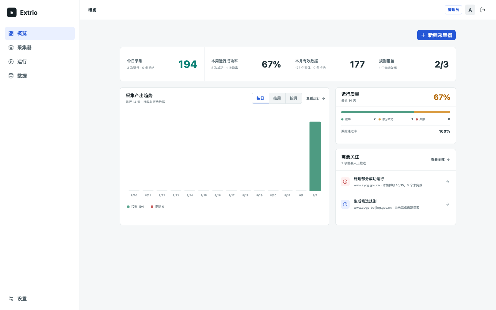
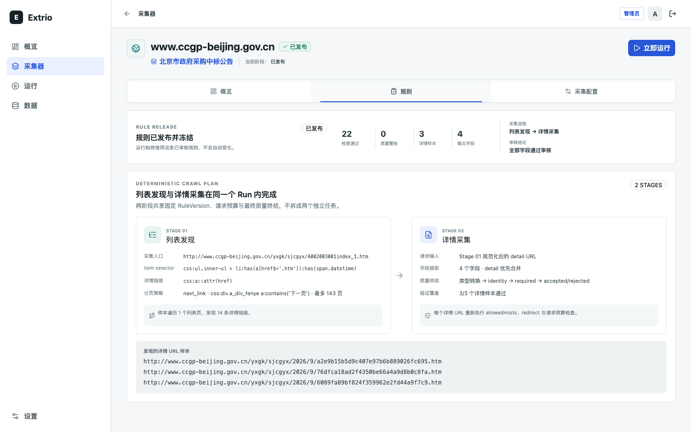
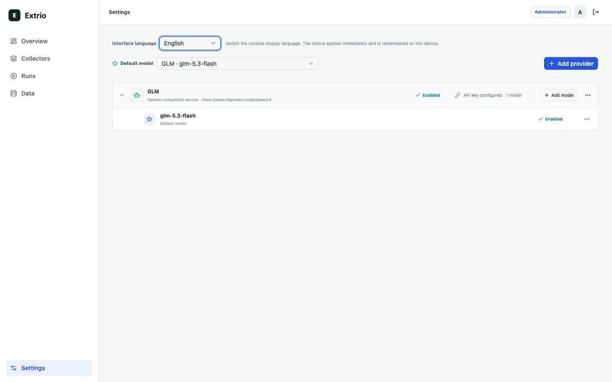

# Extrio

[](https://github.com/iiwish/extrio/actions/workflows/ci.yml)
[](LICENSE)

Extrio turns a collection intent into a reviewable `GatherSpec`, publishes an
immutable Ed25519-attested rule, and executes that fixed rule as a deterministic
collection run. It is designed for teams that need to explain not only what was
collected, but which rule, evidence, quality decision, and checkpoint produced
each item.

The repository contains a desktop React operations console and a Python control
plane with exploration and execution workers, durable operations, SQLite state,
and contract-first APIs.

> **Project status:** v0.2 self-hosted public-alpha release candidate. Extrio includes multi-user local
> accounts with role-based access control (administrator / engineer / reviewer / viewer) and first-run
> administrator setup, but it is not a hardened multi-tenant service. Keep the API and
> worker behind the bundled web proxy and review [SECURITY.md](SECURITY.md) before deployment.

## What is included

- Intent-driven collector creation with reusable collection requirements.
- Batch collector creation from an imported URL list with per-URL validation.
- Evidence-based rule review and immutable rule publication.
- Durable AI rule-task history with attempts, model usage, and review status.
- Two-stage list discovery and detail extraction with deterministic execution.
- Scheduled and manual runs with incremental checkpoints and quality gates.
- Multi-user local accounts with role-based access control: administrator (full access plus user
  management), engineer (collector, exploration, run, schedule, and sink operations), reviewer (rule
  review and publication), and viewer (read-only access with export).
- Prometheus `/metrics` endpoint with scrape-time counters for collectors, runs, items, deliveries,
  and sinks, plus build info (`EXTRIO_METRICS_ENABLED`, enabled by default, unauthenticated by
  design — bind it to an internal interface).
- Item lineage, revisions, rejection evidence, and operational dashboards.
- Bilingual operations console (中文 / English) with an in-app language switcher.
- Versioned JSON Schema and OpenAPI contracts under `docs/contracts`.

## Console preview







The console ships in Chinese and switches to English from Settings → Interface
language. The choice is remembered per device.

## Repository layout

```text
backend/             FastAPI control plane, worker, storage, and tests
web/                 React desktop console and frontend tests
docs/contracts/      OpenAPI, JSON Schema, examples, and semantics
docs/architecture/   Architecture decisions
docs/releases/       Acceptance contract and documentation manifest
docs/reviews/        Visual QA evidence and review records
docker/              Production-style container definitions
scripts/             Local development and verification utilities
```

## Quick start from source

Prerequisites: [uv](https://docs.astral.sh/uv/), Python 3.12, Node.js 22, pnpm,
and Chromium installed through Crawl4AI.

```bash
uv sync --project backend --locked --python 3.12
uv run --project backend crawl4ai-setup
pnpm --dir web install --frozen-lockfile
./scripts/dev.sh
```

Open [http://127.0.0.1:5173](http://127.0.0.1:5173). The API documentation is
available at [http://127.0.0.1:8000/docs](http://127.0.0.1:8000/docs) after login.
The first page creates the instance administrator; passwords must contain at least 8 characters. A local
tender source is seeded automatically, so the full workflow can be evaluated
without scraping a third-party site.

Stop the local processes with `./scripts/stop.sh`.

## Run with containers

Docker Compose runs the web console, API, and worker from the same source and
persists local state in a named volume.

```bash
docker compose up --build
```

Open [http://127.0.0.1:8080](http://127.0.0.1:8080). Stop the stack with
`docker compose down`. Add `-v` only when you intentionally want to delete the
local database, keys, and artifacts.

Production TLS termination must set `EXTRIO_AUTH_COOKIE_SECURE=true`. The default localhost
configuration intentionally uses a non-secure cookie so HTTP evaluation works.

## Verification

```bash
uv run --project backend ruff check backend/src backend/tests
uv run --project backend pytest
uv run --project backend python scripts/update-docset-manifest.py --check
pnpm --dir web test
pnpm --dir web lint
pnpm --dir web build
./scripts/verify-compose.sh
```

The backend can also be built as a wheel. Its contract bundle is included in the
artifact, so the installed package does not depend on a source checkout:

```bash
uv build --project backend --wheel
```

## Design and contracts

The canonical product position lives in [docs/SSOT.md](docs/SSOT.md). Start with
[docs/product-contract.md](docs/product-contract.md) for product boundaries,
[docs/backend-vertical-slice.md](docs/backend-vertical-slice.md) for runtime
architecture, and [docs/contracts/api-contract.md](docs/contracts/api-contract.md)
for the API contract.

## Contributing and license

Read [CONTRIBUTING.md](CONTRIBUTING.md) before proposing a change and report
vulnerabilities according to [SECURITY.md](SECURITY.md). Extrio is licensed under
the [Apache License 2.0](LICENSE).

Project decisions and support boundaries live in [GOVERNANCE.md](GOVERNANCE.md),
[ROADMAP.md](ROADMAP.md), and [SUPPORT.md](SUPPORT.md). Tagged releases publish
`linux/amd64` and `linux/arm64` GHCR images with SBOM, provenance, vulnerability gates, and
keyless signatures.
