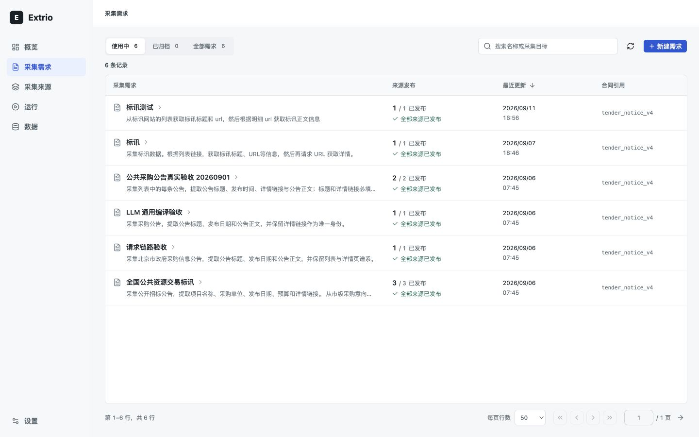
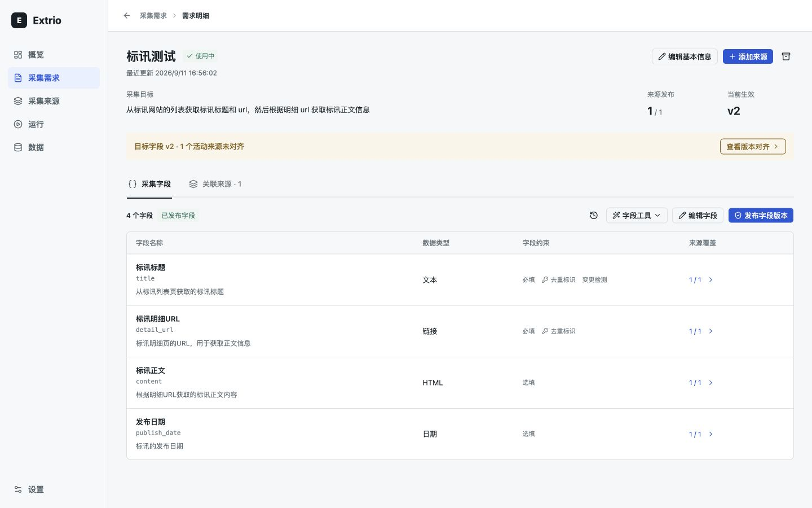
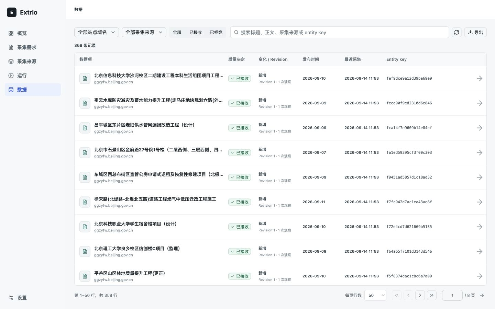

# Extrio

[](https://github.com/iiwish/extrio/actions/workflows/ci.yml)
[](LICENSE)

Extrio is a self-hosted, trusted web data pipeline for data operations teams. It
turns public or authorized list/detail sources into reviewable extraction rules,
then runs approved rules deterministically with item-level lineage and evidence.
Its initial focus is tender, regulatory, and public-notice workflows where teams
need to explain what was collected and exactly how it was produced.

The repository contains a desktop React operations console and a Python control
plane with exploration and execution workers, durable operations, SQLite state,
and contract-first APIs.

> **Project status:** v0.6 self-hosted public alpha. Current proof is repository-local: automated
> tests, deterministic fixtures, contract checks, and desktop visual reviews. A hosted trial,
> external-user validation, published scale benchmarks, and hardened multi-tenant operation are not
> yet claimed. Keep the API and worker behind the bundled web proxy and review
> [SECURITY.md](SECURITY.md) before deployment.

Extrio's product boundary is deliberate: AI assists onboarding, a human approves
the generated rule, and production runs execute the frozen rule without an LLM.
Extrio is not a general crawler toolkit, webpage chatbot, or autonomous agent platform.

## What is included

- Intent-driven collector creation with reusable collection requirements.
- Batch collector creation from an imported URL list with per-URL validation.
- Evidence-based rule review and immutable rule publication.
- Durable AI rule-task history with a live structured activity timeline, attempts, model usage,
  optional one-run operator guidance, and review status. Raw prompts, model reasoning, page bodies,
  and model response bodies are not exposed as logs.
- Two-stage list discovery and detail extraction with deterministic execution.
- Scheduled and manual runs with incremental checkpoints and quality gates.
- Multi-user local accounts with role-based access control: administrator (full access plus user
  management), engineer (collector, exploration, run, schedule, and sink operations), reviewer (rule
  review and publication), and viewer (read-only access with export).
- Prometheus `/metrics` endpoint with scrape-time counters for collectors, runs, items, deliveries,
  and sinks, plus build info (`EXTRIO_METRICS_ENABLED`; enabled by default and unauthenticated by
  design, so bind it to an internal interface).
- AI rule auto-repair: re-explore a changed site, preserve the frozen data contract, and route the
  repaired candidate through human review before publication.
- Signed evidence-bundle export: a verifiable ZIP containing rules, attestations, runs, item
  lineage, and SHA256SUMS — signed with the same Ed25519 key as rule attestations.
- MCP server for AI agents: governed collection creation and attested data queries over stdio or
  token-protected HTTP (see [MCP Server](#mcp-server)).
- Item lineage, revisions, rejection evidence, and operational dashboards.
- Bilingual operations console (中文 / English) with an in-app language switcher.
- Versioned JSON Schema and OpenAPI contracts under `docs/contracts`.

## Product maturity

- **Available now:** the self-hosted vertical workflow, constrained AI rule generation and repair,
  human review and publication, deterministic runs, evidence export, Webhook delivery, and MCP access.
- **Experimental:** broad compatibility across real-world websites, browser-rendered sources, drift
  recovery quality, and operating limits beyond the repository fixtures.
- **Planned:** a hosted evaluation environment, a curated public source corpus, published benchmarks,
  client SDKs, and production multi-tenant hardening.

## Console preview







These desktop screenshots come from repository-local acceptance instances, not a
hosted service. See the [three-minute walkthrough](docs/showcase.md) for the
demonstration sequence and the distinction between deterministic and AI evidence.

The console ships in Chinese and switches to English from Settings → Interface
language. The choice is remembered per device.

## Repository layout

```text
backend/             FastAPI control plane, worker, storage, and tests
web/                 React desktop console and frontend tests
docs/contracts/      OpenAPI, JSON Schema, examples, and semantics
docs/architecture/   Architecture decisions
docs/releases/       Acceptance contract and documentation manifest
docs/reviews/        Visual QA evidence and review records
docker/              Production-style container definitions
scripts/             Local development and verification utilities
```

## Quick start from source

Prerequisites: [uv](https://docs.astral.sh/uv/), Python 3.12, Node.js 22, pnpm,
and Chromium installed through Crawl4AI.

```bash
uv sync --project backend --locked --python 3.12
uv run --project backend crawl4ai-setup
pnpm --dir web install --frozen-lockfile
./scripts/dev.sh
```

Open [http://127.0.0.1:5173](http://127.0.0.1:5173). The API documentation is
available at [http://127.0.0.1:8000/docs](http://127.0.0.1:8000/docs) after login.
The first page creates the instance administrator; passwords must contain at least 8 characters. A local
tender source is seeded automatically, so the full workflow can be evaluated
without scraping a third-party site.

Stop the local processes with `./scripts/stop.sh`.

For isolated instances, set `EXTRIO_INSTANCE_DIR`, `EXTRIO_API_PORT`, and
`EXTRIO_WEB_PORT`; use the same instance directory when stopping. The launcher
rejects occupied ports before starting processes and waits for Worker readiness.
See the [self-hosted operations guide](docs/self-hosted-operations.md) for supported
source boundaries, SQLite/PostgreSQL upgrades, diagnostics, key rotation,
full-instance backup/restore, API/MCP clients, and observation procedures.

## Run with containers

Docker Compose runs the web console, API, and worker from the same source and
persists local state in a named volume.

`/healthz` is API liveness only. `/readyz` requires a fresh, deployment-matched
Worker and usable key material. `extrio-doctor` additionally checks migrations,
artifact access, restore state, and backup tools without creating missing state.

```bash
docker compose up --build
```

Open [http://127.0.0.1:8080](http://127.0.0.1:8080). Stop the stack with
`docker compose down`. Add `-v` only when you intentionally want to delete the
local database, keys, and artifacts.

Production TLS termination must set `EXTRIO_AUTH_COOKIE_SECURE=true`. The default localhost
configuration intentionally uses a non-secure cookie so HTTP evaluation works.

## MCP Server

Extrio ships a [Model Context Protocol](https://modelcontextprotocol.io) server
(`extrio-mcp`) so AI agents such as Claude Code, Cursor, DeepSeek, or Doubao can
use Extrio as a governed data-collection tool instead of scraping freely. Unlike
generic crawl MCPs, three properties hold:

- **Governed creation** — `create_collection` is an engineer-equivalent action that
  queues AI exploration, but the candidate rule lands in the human review queue.
  No data is collected until a reviewer publishes the rule; agents cannot publish rules.
- **Deterministic runs** — `trigger_run` executes an already-published,
  integrity-verified frozen rule. No LLM is involved at runtime.
- **Attested data** — every item read back carries the rule version, run, and
  artifact lineage that produced it.

The server opens the same store as `extrio-api` and `extrio-worker`
(`EXTRIO_DATABASE_URL` / `EXTRIO_DATABASE_PATH`), and never returns secrets.

| Tool | Purpose |
| --- | --- |
| `list_collectors` | Summaries: status, source host, active rule version, schedule, last run outcome. |
| `get_collector` | Detail: entry URL, intent, rule fields from the frozen GatherSpec, last 5 runs, sinks. |
| `query_items` | Deterministic, cursor-paginated item pages with collector/decision filters. |
| `get_item` | Full item record: extracted data, decision evidence, lineage, observations. |
| `trigger_run` | Queue a run against the published rule; fails while another run is active. |
| `create_collection` | Create a governed source and queue exploration for human review. |
| `get_run` | Run status, counts, stop reason, integrity verification, checkpoint. |

Stdio (default) for local, trusted clients:

```bash
uv run --project backend extrio-mcp            # or extrio-mcp once installed
```

```json
{
  "mcpServers": {
    "extrio": {
      "command": "extrio-mcp"
    }
  }
}
```

Streamable HTTP, enabled only with a bearer token (`EXTRIO_MCP_TOKEN`; requests
without a matching `Authorization: Bearer <token>` header receive `401`):

```bash
EXTRIO_MCP_TOKEN=change-me extrio-mcp --transport http --host 127.0.0.1 --port 8818
```

```json
{
  "mcpServers": {
    "extrio": {
      "url": "http://127.0.0.1:8818/mcp",
      "headers": {
        "Authorization": "Bearer change-me"
      }
    }
  }
}
```

## Verification

```bash
uv run --project backend ruff check backend/src backend/tests
uv run --project backend pytest -c backend/pyproject.toml backend/tests
uv run --project backend python scripts/update-docset-manifest.py --check
pnpm --dir web test
pnpm --dir web lint
pnpm --dir web build
bash scripts/verify-source.sh
./scripts/verify-compose.sh
```

Run the commands from the repository root. The explicit pytest configuration is
required: `uv --project` selects the Python project but does not change directory.
PostgreSQL integration tests require `EXTRIO_TEST_DATABASE_URL`; without it those
tests are skipped. Container verification requires a running Docker daemon.
The disposable source check uses ports 18100 and 15173; the container check uses
18000 and 18080. Set `EXTRIO_API_PORT` and `EXTRIO_WEB_PORT` to unused ports when
needed. Neither check should take over another application's listener.

For a disposable first collection without a model key or third-party traffic:

```bash
uv run --project backend python scripts/benchmark.py --collectors 1 --pages 1
```

This executes a hand-written, signed rule through the real worker against the
bundled local source in temporary storage. It verifies deterministic execution,
not AI generation quality or production capacity.

The [release readiness checklist](docs/releases/public-alpha-readiness.md) records
the remaining commit, CI and stable-release gates.

The backend can also be built as a wheel. Its contract bundle is included in the
artifact, so the installed package does not depend on a source checkout:

```bash
uv build --project backend --wheel
```

## Design and contracts

The canonical product position lives in [docs/SSOT.md](docs/SSOT.md). Start with
[docs/product-contract.md](docs/product-contract.md) for product boundaries,
[docs/backend-vertical-slice.md](docs/backend-vertical-slice.md) for runtime
architecture, and [docs/contracts/api-contract.md](docs/contracts/api-contract.md)
for the API contract.

## Contributing and license

Read [CONTRIBUTING.md](CONTRIBUTING.md) before proposing a change and report
vulnerabilities according to [SECURITY.md](SECURITY.md). Extrio is licensed under
the [Apache License 2.0](LICENSE).

Project decisions and support boundaries live in [GOVERNANCE.md](GOVERNANCE.md),
[ROADMAP.md](ROADMAP.md), and [SUPPORT.md](SUPPORT.md). Tagged releases publish
`linux/amd64` and `linux/arm64` GHCR images with SBOM, provenance, vulnerability gates, and
keyless signatures.
