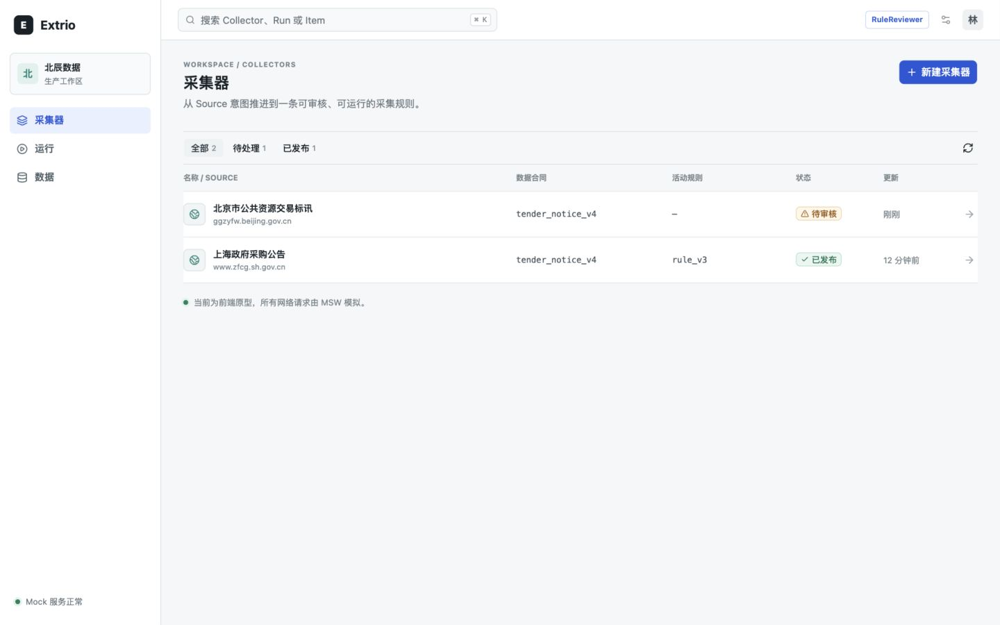
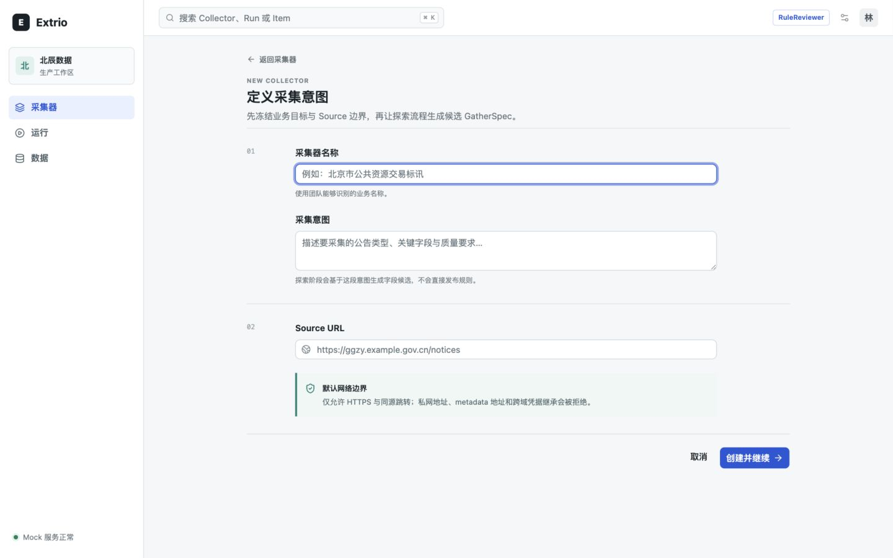
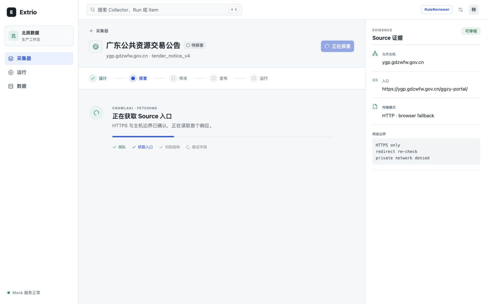
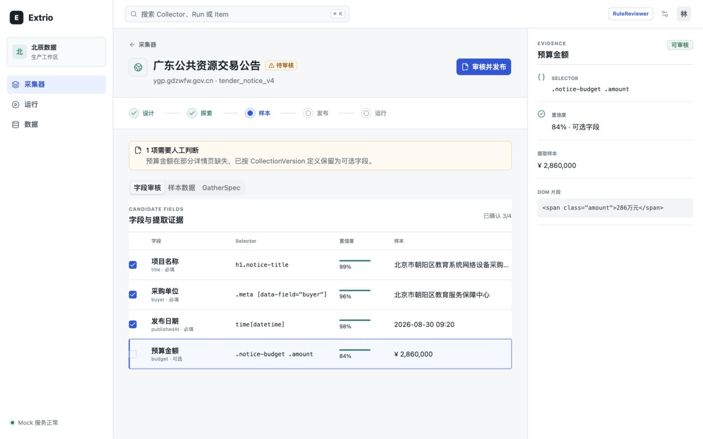
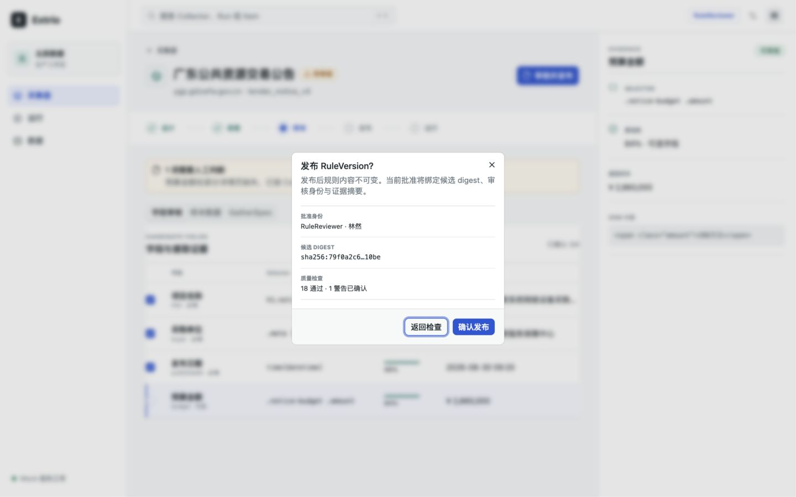
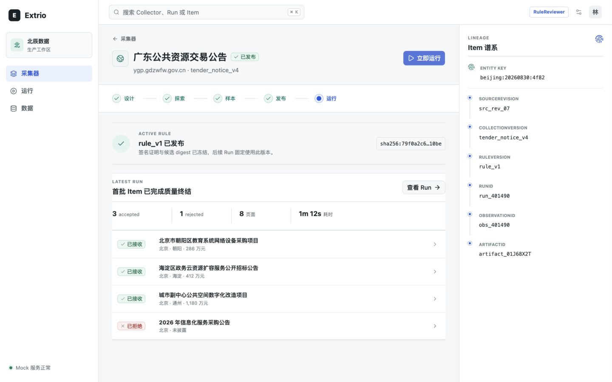
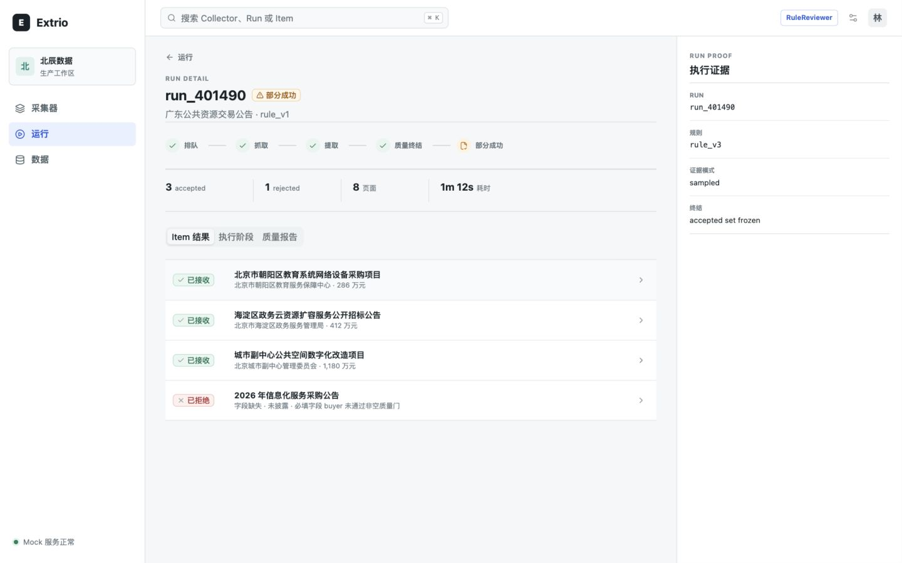
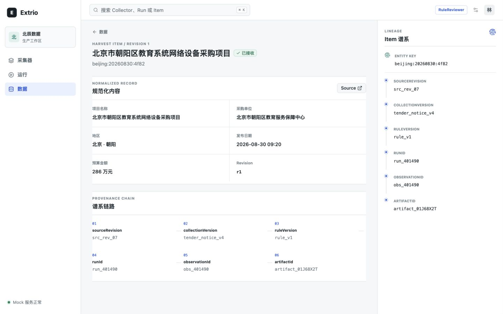
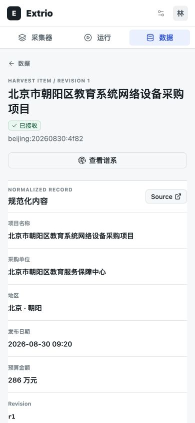

# Extrio 第一版前端原型产品审计

## 1. 审计范围

- 日期：`2026-08-30`
- 视口：桌面 `1440 × 900`，移动 `390 × 844`
- 核心任务：创建 Collector，探索 Source，审核候选规则，发布 RuleVersion，立即运行，查看 Run 与 Item 谱系。
- 目标：判断当前原型距离世界一流开源数据采集产品的差距，并给出按风险与产品价值排序的优化路线。

## 2. 总体判断

当前原型已经建立了正确且有差异化的产品骨架：`意图 -> 可审核规则 -> 确定性运行 -> 可追溯数据`。安静的运营界面、阶段 rail 与 evidence rail 的联动，比通用爬虫控制台更接近 Extrio 的长期价值。

下一阶段不应优先增加更多菜单、图表或装饰，而应把“证据可信、状态一致、故障可恢复、五分钟跑通”做成产品护城河。当前最重要的问题不是视觉精致度，而是少数界面事实互相矛盾，以及审核、诊断、纠错动作还没有形成完整工作流。

## 3. 流程证据

### Step 1：Collector 列表 — 健康度：中

优点：对象、Source、合同、规则与状态可以快速扫描。问题：列表仍是对象清单，不是运营工作队列；缺少阻断原因、下一动作、最近 Run、质量与漂移信号。

### Step 2：创建 Collector — 健康度：中上

优点：字段少、边界说明清楚，适合最小闭环。问题：没有 Collection 模板选择、连接测试、示例意图、访问方式和高级边界的渐进式配置，首次用户仍需要理解内部模型。

### Step 3：Source 探索 — 健康度：中上

优点：明确展示 Crawl4AI 所处阶段，用户知道系统没有卡死。问题：没有已耗时、资源预算、取消、重试与实时发现；右侧仍只展示静态 Source 边界，没有随阶段更新请求与页面证据。

### Step 4：字段审核 — 健康度：中

优点：字段、selector、置信度、样本和 DOM 证据联动，是原型最有潜力的核心交互。问题：复选框语义不明确；未勾选预算字段时仍可发布，用户无法判断这是“拒绝字段”“尚未审核”还是“接受警告”。

### Step 5：发布确认 — 健康度：中

优点：明确不可变、审核身份与 digest。问题：弹窗称“1 警告已确认”，但上一步预算字段并未勾选；缺少候选与当前版本 diff、证据快照、审批意见和发布影响范围。

### Step 6：首个 Run 结果 — 健康度：中上

优点：accepted/rejected、RuleVersion、Run、Observation 与 Artifact 同屏，闭环成立。问题：广东 Source 产生北京样本，破坏演示可信度；被拒绝 Item 缺少就地原因和恢复动作；发布后仍保留旧字段证据上下文。

### Step 7：Run 详情 — 健康度：差

阻断问题：页面标题显示 `rule_v1`，右侧执行证据显示 `rule_v3`。这直接违反 Extrio 的谱系不变量，必须作为 P0 修复。页面也没有把“部分成功的原因、影响和下一步”提升到第一视口。

### Step 8：Item 详情 — 健康度：中

优点：规范化记录与谱系都可见。问题：主区域与右侧 rail 重复展示同一谱系，空间没有用于 Revision diff、质量决定、原始证据、历史 Observation 或 Delivery 状态。

### Step 9：移动 Item — 健康度：中上

优点：无横向溢出，主要数据和谱系入口可达。问题：小字号元数据、部分 32–34px 控件和长标题仍需按 200% 缩放、触控目标和屏幕阅读器验证；移动端缺少全局搜索。

## 4. 优先级结论

### P0：先恢复产品事实可信度

1. 所有页面只能从同一个 Run snapshot 读取 RuleVersion、digest、Item 与 lineage；禁止 UI fixture 硬编码版本。加入跨页面 invariant test。
2. Mock 场景按 Collector/Source 保持地域、名称、RuleVersion、Run 和 Item 一致；演示数据不能跨场景串线。
3. 发布门改为明确决策模型：每个警告必须选择 `接受风险 / 修改规则 / 排除字段`，未决警告不得被描述为已确认。

### P1：把闭环升级为可工作的操作系统

1. Collector 首页从对象列表升级为行动队列：显示阻断原因、下一动作、最近 Run、质量趋势与漂移状态。
2. 将 `样本` 阶段明确为 `审核`；提供候选 RuleVersion 与 active RuleVersion 的字段、selector、Schema 和质量门 diff。
3. Evidence rail 随对象状态切换：Source 请求证据、字段 DOM、发布证明、Run evidence、Item lineage；支持 pin、返回选择和深链。
4. Run 详情第一视口回答三件事：为什么是该终态、影响多少 Item、用户下一步能做什么。补齐重试、重新处理、比较 Attempt 和查看 Artifact。
5. Run Item 行可以直接打开 Item；数据列表增加 Collector、Source、Run、决定、时间范围筛选并保存到 URL。
6. Item 主区域用于内容与 Revision diff，右侧用于证据和可导航谱系，删除重复信息。
7. 全局搜索、筛选、快捷键和设置要么真实可用，要么在原型中移除，不保留假 affordance。

### P2：建立世界一流开源产品的产品层

1. 提供五分钟 Quickstart：内置合法 Source fixture、示例 Collection、一次审核与一次 Run，离线即可完成。
2. 前端类型由 OpenAPI/JSON Schema 生成；状态机、错误码和 capability 由机器合同驱动，不由页面自行枚举。
3. 发布可复用设计系统、Storybook、键盘路径、WCAG 2.2 AA 基线与视觉回归测试。
4. 用统一产品语言呈现 Crawl4AI 编译与 Crawlee 执行；引擎名称作为证据元数据，不把两个框架暴露为两套产品心智。
5. 建立插件与能力发现界面：transport、extractor、storage、sink 的 capability 清单、兼容版本和诊断状态。

## 5. 北极星体验

用户首次启动后五分钟内完成：选择示例或输入 URL -> 测试访问边界 -> 看到候选规则与真实样本 -> 逐项解决警告 -> 发布不可变规则 -> 完成一次确定性 Run -> 从任一 Item 回溯到 Source 响应。

建议核心指标：首次有效 Run 时间 `< 5 分钟`；失败原因识别时间 `< 2 分钟`；从异常到可执行修复动作不超过 `3 次点击`；跨页面谱系事实不一致数为 `0`。

## 6. 不建议做

- 不先增加大而全 Dashboard、计费、市场、AI 对话框或更多一级导航。
- 不把产品做成 Crawl4AI 与 Crawlee 控件的简单拼盘。
- 不通过更重的颜色、渐变、大卡片或营销式首页制造“高级感”。
- 不在规则事实、审核语义和恢复路径尚未可信前扩展真实后端范围。

## 7. 证据边界

本审计验证了可见流程、桌面与移动重排、浏览器语义结构和主要交互。尚未完成屏幕阅读器、200%/400% 缩放、完整键盘顺序、真实网络失败、长文本/大数据量、国际化、权限差异和真实 Crawl4AI/Crawlee 性能验证，因此不能据此宣称完整 WCAG 合规或生产可用。
