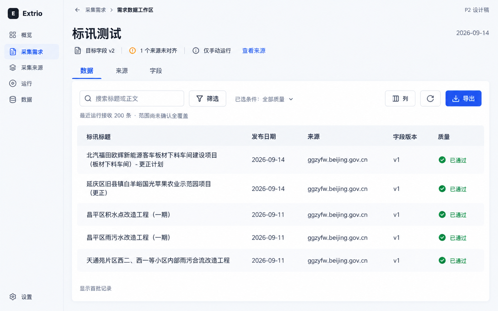
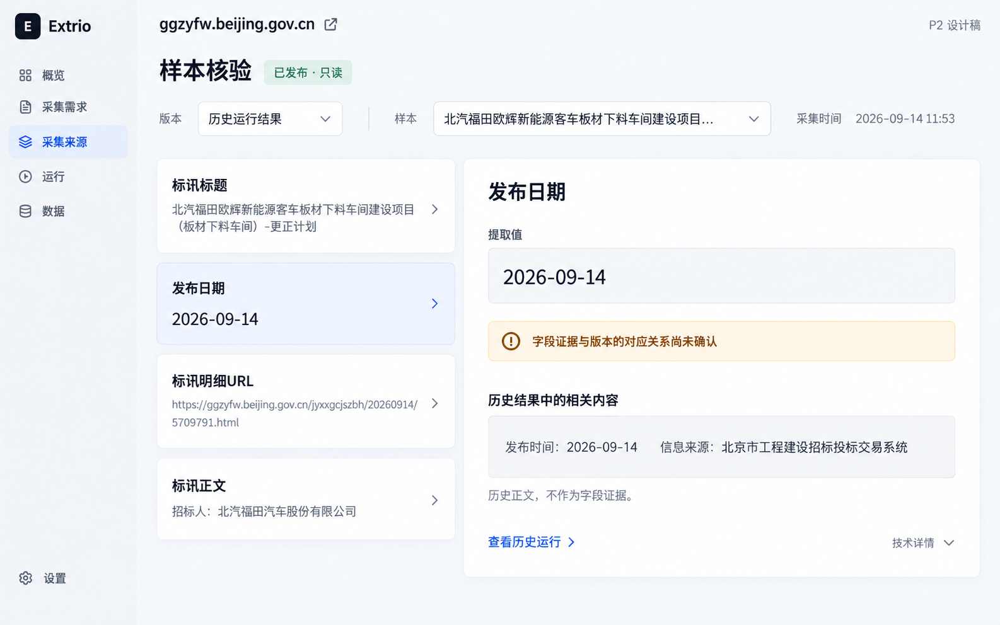
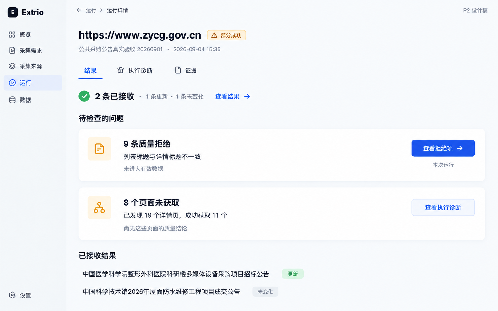

# P2：三个结果优先设计样板

状态：来源 URL 配置子项已获用户确认并在正式前端实现，其余设计样板待用户确认。日期：2026-09-14。P0/P1 [技术验收通过](../../reviews/product-trust-acceptance-2026-09-14/review.md)。[SU-01](../../planning/source-url-workspace.md) 定义来源页的已实现范围；本文其余目标不代表当前产品已具备相应页面或 API。

## 目标与边界

服务对招投标、监管公告、公共通知数据负责的运营人员。三条任务分别回答：数据在哪里、这个字段为什么可信、这次运行还缺什么。保留唯一正式前端、Collection 身份、不可变版本、历史归属与人工发布边界，不另建可执行 demo。

用户授权来源 URL 配置在现有原型实现，不再生成图片；不授权部署、真实采集、修改实例调度或启动付费 AI。三张图是三个互补工作流样板，不是三套互斥品牌风格。图片为 AI 生成视觉草案，真实实例截图与代码是事实依据；文中的字段、权限和状态契约优先于图片文字。

## 共同设计契约

- 业务结果占主体，内部 ID、digest、selector 和执行机制放入技术详情；不删除诊断能力。
- 保留全局导航；需求内主分区为「数据 / 来源 / 字段」，不添加没有真实能力支撑的交付或活动空壳。
- 页面头部依次为对象身份、事实状态、当前任务操作。发布、运行成功、版本对齐、持续更新、范围完整分别表达，不用一个绿色总状态代替。
- 主操作每个局部任务最多一个；筛选用选择控件，视图用 Tabs，二元选择用 checkbox/toggle，工具图标有 tooltip 与可访问名称。
- 表格为语义 table，列头与单元格关联；业务标题可两行，完整内容在详情可读。字段为空、源数据缺失、旧版本无此字段是不同状态。
- 白色与中性浅灰底，深灰文字，钴蓝动作、绿色明确通过、琥珀色缺口、红色失败。基础字体 14px、次级 12px、标题 22-24px，字距 0；不靠缩小字体容纳长文。
- 视觉以轻卡片和留白建立层级：独立问题、字段对象使用白色卡片，数据表和证据核验作为有明确边界的工具。页面头部与分区不做浮动卡片，不嵌套卡片；圆角最多 8px，细边框或极轻阴影二选一。不使用贯穿多栏的分隔线、竖向表格线或大型统计卡墙。
- 默认只展开当前任务需要的信息。需求列表不常驻详情；运行首屏不同时展开分类、记录和诊断；选择记录后才打开详情。靠「先看结果，再看问题，最后查证据」控制认知负担，而非只把线条换成卡片边框。
- 远端状态归 Query；视图、筛选、排序、选中记录/字段归 URL；未提交编辑留局部并受离页保护。刷新不能重复发送命令。
- 可取消加载、首屏 skeleton、保留已有结果的刷新错误、分页错误独立重试。请求错误不显示为「零条数据」。

### 桌面布局

| 视口 | 需求数据 | 样本核验 | 部分失败 |
| --- | --- | --- | --- |
| 1440x900 | 192px 全局导航，全宽数据表；选中后 480px 详情抽屉 | 36% 字段对象卡，64% 单一证据工具；版本和样本在顶部选择 | 单列问题对象卡；进入问题后同区记录列表，选中再开详情抽屉 |
| 1280x800 | 全宽数据表，420px 详情抽屉 | 两列，长 URL 换行，选择工具条可两行 | 问题卡按钮同行；记录详情抽屉 |
| 1132x1028 | 同 1280，增加可见行而非放大字体 | 两列，字段值允许展开 | 同 1280 |
| 1024x800 | 24px 内容边距，工具条两行，表格局部横滚；不隐藏版本/质量含义 | 字段列表与证据上下排列，选中后定位证据标题 | 问题卡按钮可换行，详情抽屉不超可用宽度 |

抽屉 Escape 关闭、焦点返回触发项，Tab 不进入背景；URL 直接访问选中项时也可关闭并回到列表。加载完成或错误用简短 live region 播报。200% 缩放和屏幕阅读器验证归 P3，P2 图片不证明无障碍合规。低于 1024px 不支持。

## 样板 A：需求数据工作区

### 首屏与任务

进入已有需求默认「数据」，不再先进入字段编辑。有数据时直接阅读；无数据时仍保留这个稳定入口，不根据请求时序自动切分区。

页头展示需求名、目标字段版本、未对齐/未知来源数、调度事实的来源数量，混合调度不得合成「已开启自动更新」。真实例子是标讯测试目标 v2，来源执行 v1，仅手动运行。未对齐摘要可进入来源分区；页面不自动迁移来源。

数据表按业务字段呈现，首批包含标讯标题、发布日期、来源、历史字段版本。正文不占巨大表格列，在选中详情阅读；Entity key 进入技术详情。主操作「导出」导出当前筛选全集，不是已加载的首批记录；格式菜单 CSV/JSONL，超过上限显示真实错误与缩小范围入口。

默认全宽表格，不预选第一条或自动打开侧栏。工具条常驻搜索、筛选入口、刷新、导出；字段版本、来源、日期区间在筛选弹层展开，已生效条件可见且可移除。「全部质量」是默认视图，不作为已选筛选徽标。表格列使用轻底色和对齐关系，不用竖线；行悬停与键盘焦点独立可辨。查看字段内容、质量与证据均在同一记录详情内渐进展开，关闭恢复列表位置。

### 数据语义

- 默认当前需求内的实体最新记录；必须按冻结历史归属限定需求，不能用当前来源列表拼接。归属未知单独提示，不能混入任意需求。
- 实体身份至少包含历史 Collection、Collector、entityKey；服务端先取该身份最新状态，再筛选。不得让旧的匹配记录替代最新状态。
- 默认「全部质量决定」并明确拒绝标记；「已接收」不冒充该实体此前所有有效版本。需要业务有效视图时另立明确查询合同。
- 默认按采集时间降序及稳定唯一键排序。发布日期排序、字段筛选必须由服务端支持，并与游标、计数、导出共用语义；禁止只排序已加载 50 条。
- 首批业务筛选限定文本包含、日期区间和字段存在性；字段来自所选冻结版本，可选字段版本。跨版本不可比较的字段提示选择版本，不静默转字符串比较。
- 200 是实例最近运行接收数，不直接当成需求实体总数。总数来自同一查询条件的服务端聚合；加载数量与总数分别显示。
- 初次实现以请求时当前快照为准，导出时明确生成时间；并发采集下如需与页面严格同一快照，必须提供服务端 snapshot token，不宣称已有一致性保证。

### 状态矩阵

| 状态 | 呈现 | 下一步/限制 |
| --- | --- | --- |
| 成功 | 全量查询总数、已加载数、业务表格、版本与质量 | 阅读、筛选、按条件导出 |
| 空需求 | 「尚无采集来源」，字段状态保留 | 有权限者添加来源；只读者只看说明 |
| 有来源无结果 | 「尚无采集结果」，区分未运行与已运行零结果 | 查看来源/最近运行，不制造采集成功 |
| 筛选无匹配 | 当前条件及「无匹配数据」 | 清除条件，不建议重建来源 |
| 失败 | 请求错误与重试；已有列表保留并标记未刷新 | 不将旧总数当最新；403/404不无限重试 |
| 只读 | 可查看；导出按既有服务端授权决定 | 隐藏写操作，不改变来源/版本 |
| 处理中 | 当前运行状态与已有历史结果分开 | 不清空已有数据，不把进度计数当最终总数 |

URL 目标：`/collections/:id?section=data&q=...&source=...&version=...&sort=...&item=...`；参数最终名称在 P3 API 合同中确认。切条件重置游标；返回详情恢复原筛选与已加载位置。无此历史归属的 item 显示不属于当前需求，禁止自动扩大全局范围。

## 样板 B：来源配置与辅助核验

### URL 配置主任务

来源详情首先回答「从哪里采、采什么、何时采、采多大范围」。普通进入默认「采集配置」，完整 URL 是首屏的核心对象，提供复制、外部打开与编辑；下方展示采集说明、所属需求、定时运行和采集范围。轻边框只界定 URL 配置工具，其余区域以间距组织；数据合同、推送投递和规则技术工作区按需展开。

「运行与结果」「规则与证据」是辅助任务。待审核默认直达审核；显式 section 深链接优先于默认值。URL 编辑保持既有保存确认和风险提示，不提供模拟连接成功或保存即采集。SU-01 已实现上述范围，真实界面见 [验收记录](../../reviews/source-url-workspace/verification.md)。

### 样本与证据目标

图稿对应来源的辅助核验任务，不是来源默认首页；该样本证据重排仍为待实现目标。沿用来源「规则与证据」分区，不新增第二份规则入口。先选择版本语境和样本，再按字段逐行核对：字段名称、提取值、必填/类型结论、审核状态。选中字段后展示原始值、规范化值、对应采集时的来源片段；selector 与完整合同折叠到技术详情。当前网页只作为外部链接，不当作采集时证据。

阅读顺序固定为「来源 → 证据语境 → 样本 → 字段 → 证据」。语境选择为候选、已发布规则或历史运行结果；语境不是版本号，具体版本/时间另行显示。左侧各字段是独立对象卡，右侧单一核验工具只呈现当前字段的值、证据和结论。提取值、来源片段不再拆成互斥 Tabs，技术详情折叠；查看一个值不需要来回切页。版本未知用紧凑提示，不用巨大空状态覆盖仍然可读的历史结果。

必须区分候选 digest、已发布 RuleVersion、历史 Run 和 Item；只在对应关系验证后显示「此版本的证据」。候选 field.sample/evidence 不可自动包装成发布版本快照。图中展示的是**版本关系无法确认的边界样例**，不是对本实例证据已失配的断言。

候选待审核时逐字段接受、接受风险、排除或待定沿用已有语义和发布门；排除必填字段等非法决定依服务端校验。发布区给出决定摘要，确认后才发送命令。已发布只读，不提供就地编辑已发布规则；修订必须明确创建候选，不隐式发布。

### 状态矩阵

| 状态 | 呈现 | 下一步/限制 |
| --- | --- | --- |
| 成功且匹配 | 固定版本、样本索引、提取值、来源片段、审核结论 | 逐字段核验；候选按权限审核 |
| 无样本 | 「尚无验证样本」；无通过标记 | 有权限者走已有验证/生成流程 |
| 证据缺失/过期 | 提取值仍可读，证据区说明缺失/过期和可用等级 | 历史结果或元数据可查，不伪造片段 |
| 版本关系未知 | 分别标识候选和已发布引用，证据不盖通过章 | 查看历史运行，禁止混用 |
| 请求失败 | 保留选择与未提交决定，错误就地展示 | 重试读取，不重发发布 |
| 只读/已发布 | 完整核验内容，审核决定只读 | 不呈现可提交的审核/发布控件 |
| 验证处理中 | 阶段、已完成事实、取消能力按现有合同 | 禁止提交过时 digest；完成后复核新候选 |

URL 目标：`/collectors/:id?section=rule&context=...&sample=...&field=...`。候选 digest 更新时旧审核决定失效并提示；失效字段 ID 回落到字段列表，不展示别的字段作为相同证据。原始 HTML 仅文本转义或严格净化，不运行脚本、不载入第三方追踪资源。

## 样板 C：部分失败处置

### 首屏与任务

保持 Run 是一次不可变历史执行。默认首屏按「已保存结果 → 待检查问题 → 已接收记录」组织，不常驻分类侧栏或详情栏。接收数及更新/未变化数在紧凑结果摘要显示；质量拒绝和未获取各是一张独立问题卡，每张只有数量、原因/影响、对应动作。没有该问题时不留空卡片，全部成功直接以结果为主体。

问题卡不是记录容器，内部不嵌套表格或更多卡片。「查看拒绝项」在结果分区进入本次拒绝列表并聚焦标题，显示「返回结果概览」；选中记录才打开详情，关闭回到列表。「查看执行诊断」进入诊断分区，保留问题来源。URL 使用 section、decision、item 表达状态，浏览器返回逐层恢复，不另建全局问题路由。

Run 主导航为「结果 / 执行诊断 / 证据」。范围、分页停止、预算与检查点归执行诊断的按需分组，证据有效性与运行完整性归证据；首屏始终保留范围未确认提示。P3 必须兼容既有 section=process/scope/quality 深链接，不让导航收敛导致旧链接失效或信息删除。已保存结果随时可读，用户不必先处理问题才能使用数据。

实例为 2 接收（1 更新、1 未变化）、9 质量拒绝、8 未获取页面。不是 19 条新数据，也不是 17 条质量错误。9 条已返回记录具有标题不一致原因，可分组；仅有总数的 8 页不能编造 URL 或逐页错误列表。

质量拒绝默认「查看字段证据」；获取失败默认「查看执行诊断」；结构问题才指向修订候选；版本未对齐在需求来源路径处理，不修改本次历史版本。每个入口保留当前 Run、筛选与返回位置。

### 状态矩阵

| 状态 | 呈现 | 下一步/限制 |
| --- | --- | --- |
| 全部成功 | 结果列表；若预算/页数停止，仍显示范围未确认 | 阅读/导出，不强制修规则 |
| 部分成功 | 三组独立计数、原因与结果 | 质量到证据，获取到执行诊断 |
| 零条拒绝 | 拒绝分组为 0，无拒绝记录 | 不等于没有未获取页面 |
| 汇总有拒绝但记录缺失 | 已载入数/汇总数，记录不可用说明 | 重试读取或查看运行证据，不假装 0 |
| 全部失败 | 停止阶段、服务端错误、可用历史产物 | 通用失败不默认引导修规则 |
| 只读/来源已删除 | 历史结果和证据仍可查看 | 写操作按权限与来源状态禁用 |
| 运行中 | 当前阶段和实时计数标「进行中」 | 不展示最终质量结论，不重复启动 |
| 后续修复中/成功 | 新操作与新 Run 独立记录 | 不把旧拒绝项改成接收，不声称旧 Run 已修复 |

首批只贯通已有诊断和审核/完整运行命令，不提供「仅重试失败页面」「一键全部解决」「标记已恢复」。这些能力需要失败集合、恢复关联、授权、租约、幂等、检查点和交付回归，另立执行合同。

## API 与实现缺口

| 能力 | 代码证据 | P3 决策 |
| --- | --- | --- |
| 全量分页和导出 | `web/src/api/client.ts` ItemsQuery；`backend/src/extrio/app.py` list_items/export_items；store.list_items_cursor/iter_items_export | 复用，不重建 |
| 需求级历史归属过滤 | 当前 ItemsQuery 和两个路由没有 collectionId/version 过滤；store 实体分区含历史 Collection | 新增同源过滤、计数与 facets；未知归属边界测试 |
| 业务字段过滤/排序 | `_item_filter_clauses` q 仅覆盖 title/content/collectorName/entityKey；sort_key 只允许 observed_at | 新增白名单字段操作、类型和空值规则，SQLite/PG双实现与游标绑定 |
| 前端实体身份 | `latestEntities` 仅 Collector+entityKey，与服务端含历史 Collection 的分区不同 | P3-A 必须同步修正，不能把跨需求实体折叠；添加迁移归属回归 |
| 字段样本与片段 | CandidateField 有 sample/evidence，EvidenceRail 可展示；ValidationWorkspace 已发布首屏仅摘要及流程 | 复用真实字段数据，验证版本对应；缺少绑定元数据才补 API，不伪造 |
| 本次拒绝集合 | Run.items 和 itemsPage(runId,decision,view=observations) 已有 | 复用分页接口及过滤；不能用 entities 查询替换本次 observations |
| 未获取逐页集合 | 当前 Run 合同仅汇总与停止原因，未提供完整失败 URL 集合 | 首批聚合诊断；不画可操作假列表 |
| 等价回放 | `/runs/{runId}/evidence` 明确 sampled 可用性而非等价回放授权 | 尊重 canReplay 与证据等级，不开放假回放 |

## 真实数据桌面推演

1. 打开标讯测试：读到目标 v2、来源未对齐、仅手动。进入数据后，记录标签仍是历史 v1。判断「结果可读，但新字段目标尚未落实」，而非全绿完成。实例证据为验收截图 03/04/08/09；需求级聚合尚不可操作，未声称已端到端通过。
2. 选择已采集标题，再选发布日期：读取 2026-09-14，核对同一版本/样本引用；证据缺失显示不可核验，不能拿正文的相同字符串替代字段证据。候选/发布版本切换不得沿用旧决定。字段对应完整 UI 属待实现方案。
3. 打开部分成功：先看到 2 条接收及更新/未变化事实，再看到 9 条质量拒绝和 8 页未获取两张问题卡；进入拒绝列表后选中真实标题，读取标题不一致原因；未获取卡进入诊断而非修规则；回到已接收结果不丢上下文。P1 实机已验证 9 条筛选/刷新和诊断焦点，P2 问题卡及渐进详情尚未实现。

以上为设计者基于真实记录的桌面推演，不是外部目标用户无协助测试。首次可信结果时间、无协助完成率和恢复完成率均未测得，不填写虚构数值。

## 图稿审阅与待确认

图稿布局可用于评审，不可逐像素照搬生成文字。A 的「已通过」应统一为质量决定「已接收」，筛选默认值不标为已选条件，列工具使用图标及 tooltip。B 的「版本」选择标签应为「证据语境」，已发布状态明确属于来源；右侧只保留证据工具外边界，提取值和正文不增加内层圆角容器。C 的问题卡以 8px 圆角和紧凑图标实现，不沿用生成图中放大的圆角、字级或图标；两个接收结果为真实实例记录。所有最终文案须走中英文资源及测试。

用户评审重点：是否接受「全宽数据表，点选再看详情」「按样本逐字段核验」「先结果后问题卡，诊断按需进入」三个后续工作流。轻卡片、少分隔线及来源 URL 优先方向已获确认；SU-01 之外的改造仍需对应页面方案确认。

## P3 交接顺序

| 工作包 | 范围 | 验收重点 |
| --- | --- | --- |
| P3-A 需求内数据 | API/Store/OpenAPI/生成类型、Collection 数据分区、Items 共用查询展示、业务字段导出 | 历史归属、同名实体不合并、全量筛选排序与导出一致、游标条件绑定、空/错/权限 |
| P3-B 样本证据 | Collector 核验布局、EvidenceRail、必要版本引用接口、文案 | 候选/发布/历史不混用，字段选择可恢复，审核受 digest 和角色约束 |
| P3-C 部分失败 | Run 分组列表、详情、已有诊断路径、必要分页 | 本次 observations 完整、9/8独立、不能冒充子集重试或历史修复 |

每个包先确认执行合同、写失败回归，再实现；前端 test/build/lint、OpenAPI 类型同步；涉及查询的后端 SQLite/PG 测试；真实桌面四尺寸、中英文、键盘/焦点、长文本和错误恢复。数据写入/恢复能力另行明确批准。全站视觉推广及开源采用归 P4/P5。
