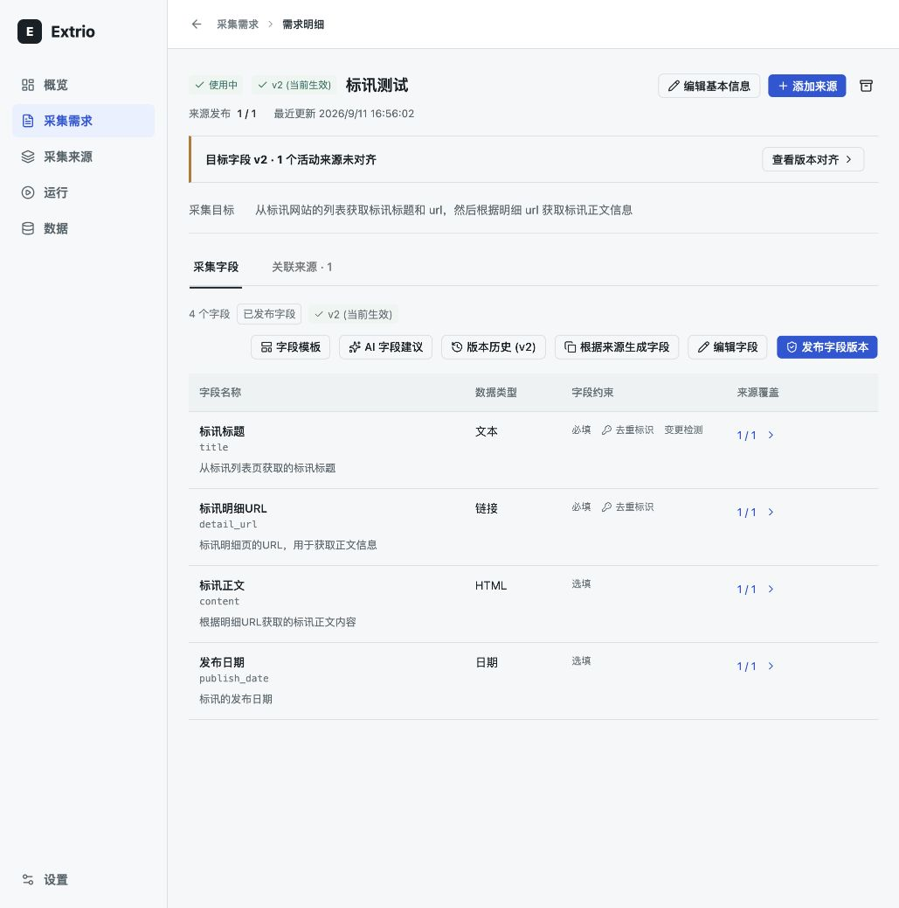
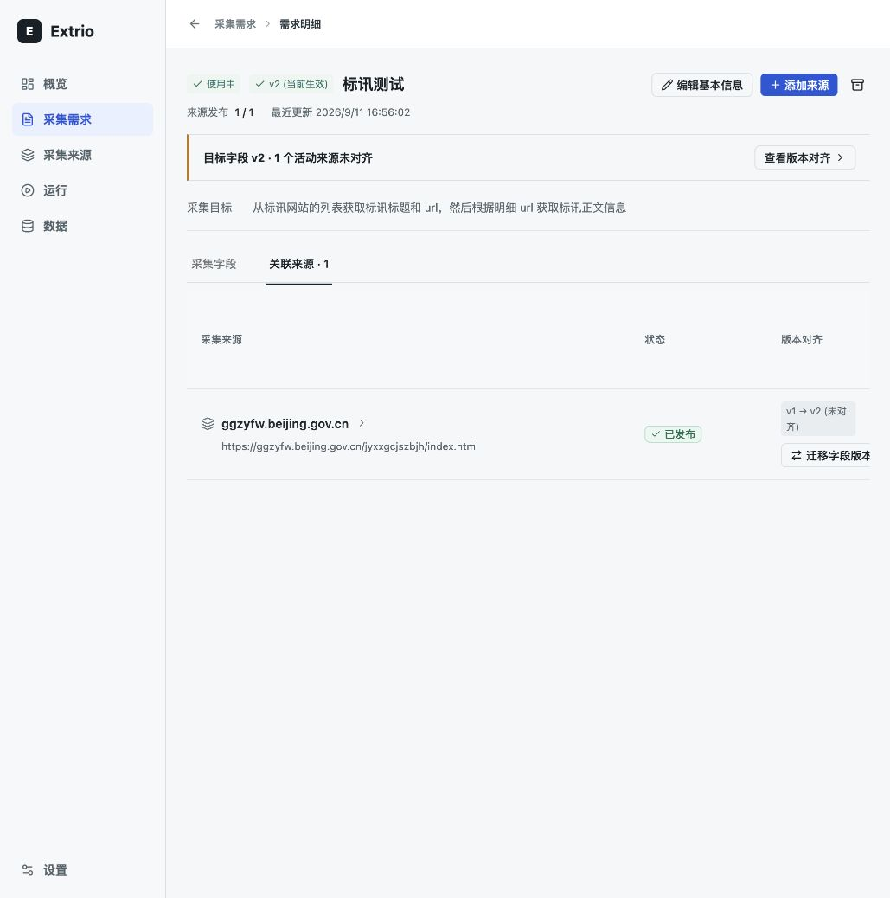
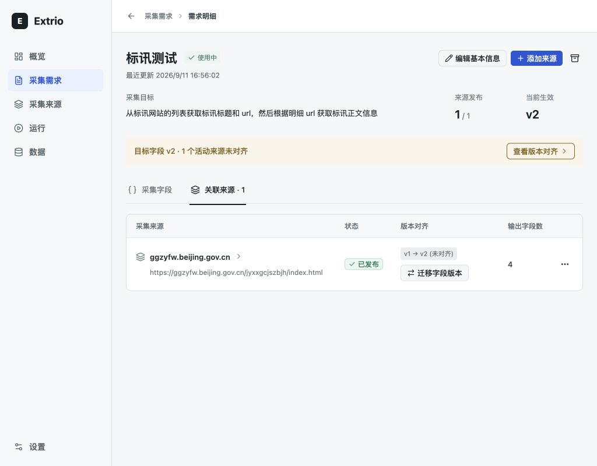

# 需求明细首轮验收

日期：2026-09-14。状态：工程验证通过，待用户视觉复核。清单和边界见 [详情页逐页打磨](../../planning/detail-page-polish.md)。

## 走查与结果

1. 需求首屏：名称和目标清晰，生效版本与来源发布覆盖分开表达，状态不再抢占名称位置。观察对象为真实本地「标讯测试」需求；1 个来源规则已发布，但目标字段 v2 尚未对齐，界面保留这一差异。
2. 字段工作区：编辑、发布和字段状态可见；模板、AI 建议、来源导入集中于字段工具菜单，历史以具名图标访问。查看菜单和模板不写入数据。键盘进入模板、取消后焦点返回字段工具通过测试；来源导入取消的焦点返回通过测试与浏览器检查。
3. 关联来源：五列及管理入口在最小桌面宽度 1024px 内可见。原表格将前 3 列分配 65%/20%/15%，挤出了输出字段数与操作；固定状态、对齐、字段数和操作宽度后，来源名称使用剩余空间，长 URL 可换行。
4. 本地编辑：字段草稿、未保存提示、页头操作禁用、保存与取消正常；最小尺寸中行内编辑/删除保持同行。浏览器仅进入和取消本地编辑，未保存、发布、迁移、归档、创建来源或触发模型生成。

## 原始截图

## 实现截图

| 分区 | 1440x900 | 1280x800 | 1132x1028 | 1024x800 |
| --- | --- | --- | --- | --- |
| 采集字段 | [截图](fields-1440.png) | [截图](fields-1280.png) | [截图](fields-1132.png) | [截图](fields-1024.png) |
| 关联来源 | [截图](sources-1440.png) | [截图](sources-1280.png) | [截图](sources-1132.png) | [截图](sources-1024.png) |

附加状态：[工具菜单](tools-menu-1024.png)、[模板预览](template-preview-1024.png)、[字段编辑](edit-fields-1024.png)。所有截图来自本轮真实本地页面，均已查看；浏览器视口覆盖已恢复。

所有尺寸 document.scrollWidth 等于视口宽度。字段查看态工具栏高 28px；来源管理列右边界分别为 1407、1247、1107、999px，位于页面内容区内。

## 自动验证

- `cd web && pnpm test`：42 个文件、259 项测试通过。
- `cd web && pnpm build`：通过。
- `cd web && pnpm lint`：通过。
- `git diff --check`：通过。
- 新增/调整测试包括菜单化入口、模板键盘访问及焦点恢复、来源导入关闭不写入、只读工具隐藏、编辑时工具禁用、标题顺序及来源五列；已有权限、草稿、冲突、发布和迁移保护用例通过。

本轮没有后端和数据合同变更，没有重新执行后端测试。其他未提交文件保留。

## 设计与边界

Standard 运营页面评审：产品匹配、首屏任务、信息组织、字体、配色、桌面布局、交互及合同一致性通过；不适用营销视觉与装饰资产要求。适用维度 23/24，平均 1.92/2；状态验证为 1，其余适用维度为 2。该分数为内部检查，不替代用户签收。

本轮视觉主要使用中文、有字段和有关联来源的真实需求。空数据、只读、归档、长目标及错误保护由已有组件测试覆盖，未逐一做真实 API 的视觉状态截图；英文工具栏可换行但未独立截图验收。未做屏幕阅读器完整审计，不能据截图宣称完整可访问性合规。未审计其余详情页，按清单后续逐页开展。
