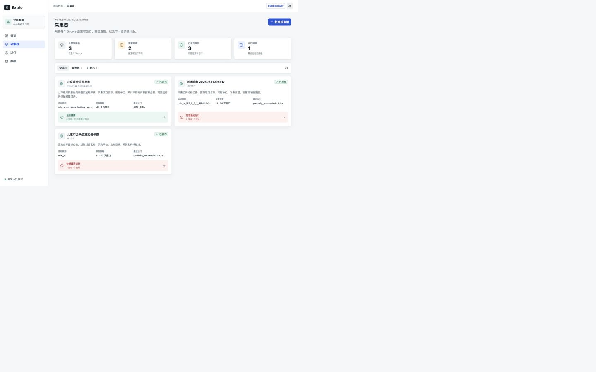
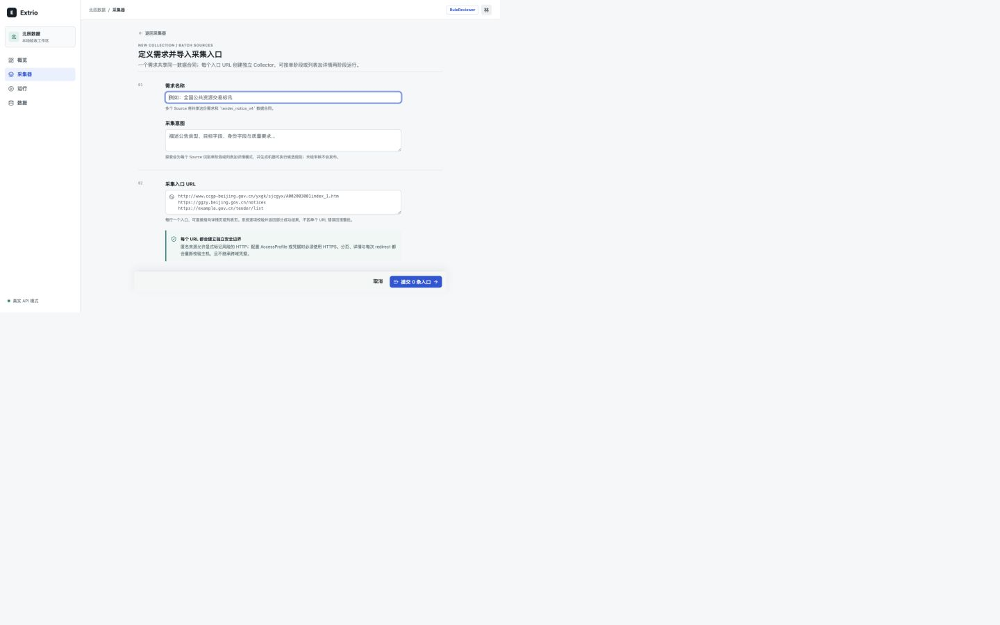
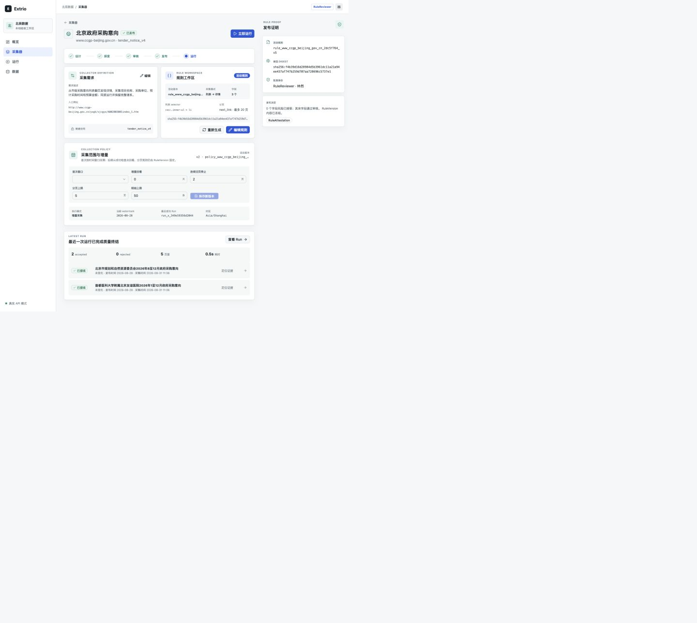

# Collector 需求分组审查

## 结论

Collector 必须绑定一个明确的 Collection，但当前阶段不需要引入通用文件夹。运营视图应保留跨需求扫描能力，同时提供需求筛选和按需求分组视图。

## 当前流程

1. 采集器列表：健康度与下一动作清晰，但列表完全扁平，卡片没有显示所属需求。
2. 批量创建：已经清楚说明一个需求共享数据合同、每个 URL 创建独立 Collector。
3. Collector 详情：展示需求描述和数据合同，但缺少可导航的 Collection 身份，容易让用户误以为需求是 Collector 自有字段。

## 建议

- Collector API 增加稳定的 `collectionId` 与 `collectionName`，Collector 名称改为来源或入口级名称。
- 列表卡片显示需求标签，并增加需求筛选和“平铺 / 按需求”视图切换。
- 默认运营视图继续平铺并按阻断优先；管理视图按需求汇总 Collector 数量、健康度和待处理数。
- Collector 详情使用“需求名称 / 来源名称”面包屑；共享需求只读展示并链接到需求级编辑入口。
- 暂不增加任意文件夹。团队、客户或区域等横向整理需求出现后，优先增加标签，再评估文件夹。

## 证据

