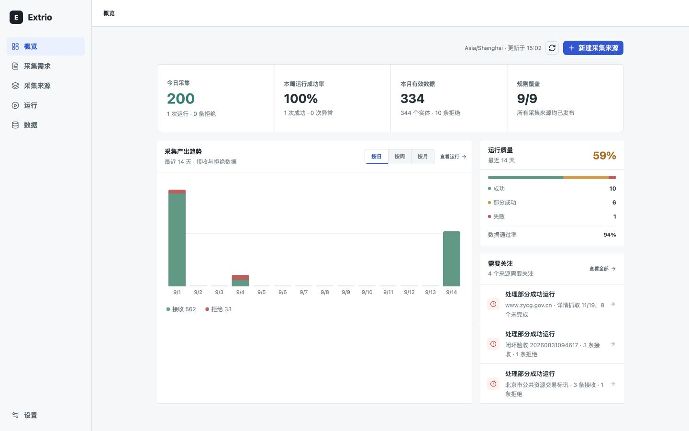
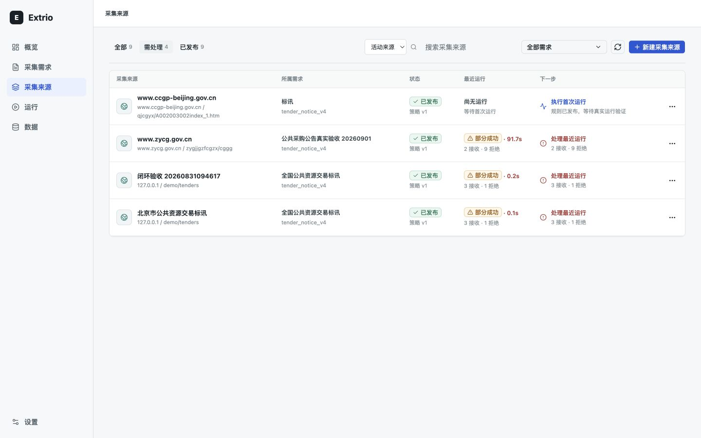
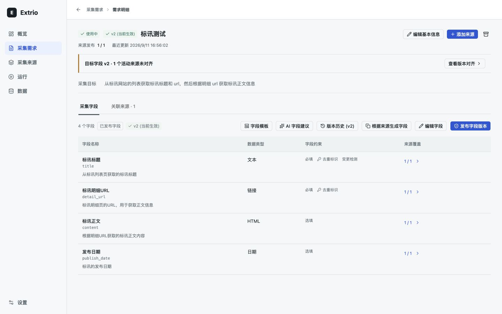
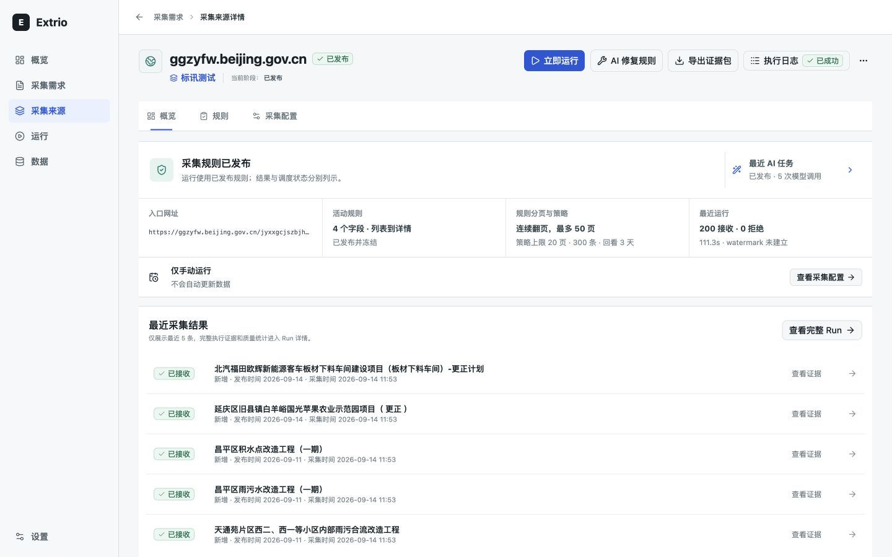
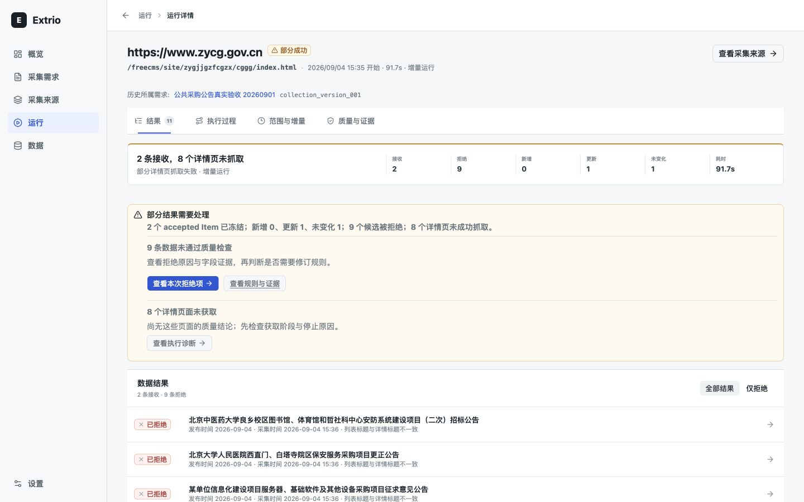
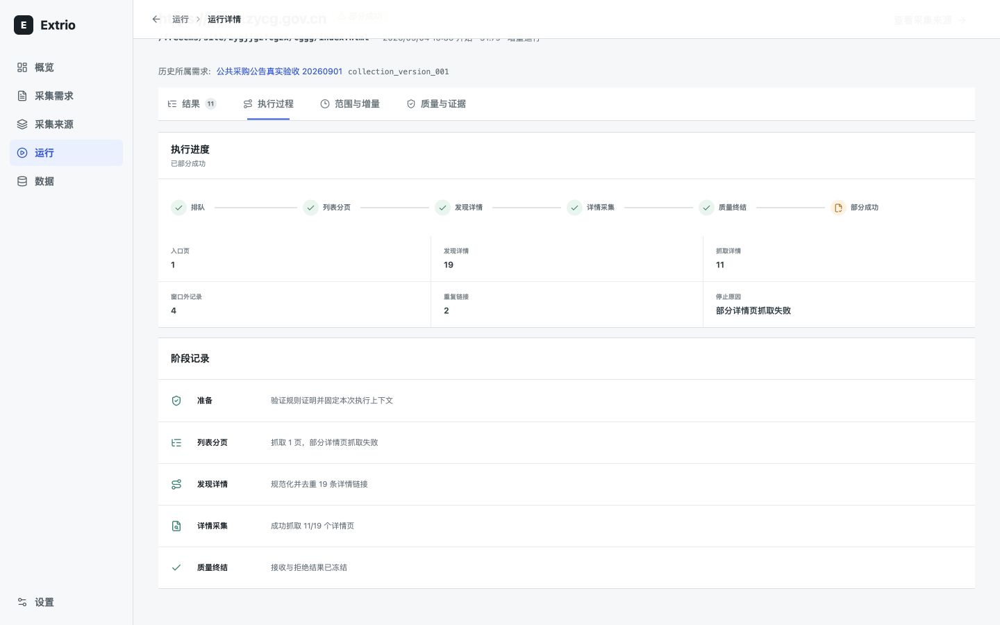
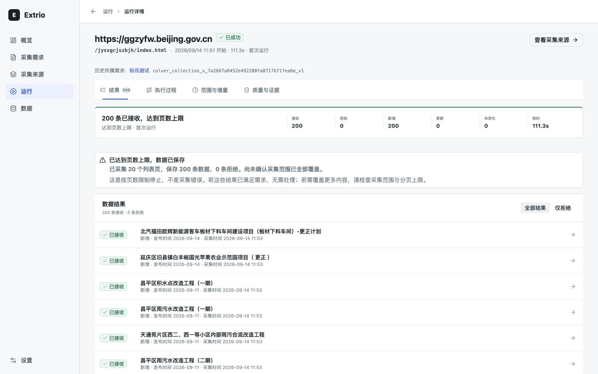

# P0 / P1 验收

日期：2026-09-14。结论：按既定范围技术验收通过，无新增阻断发现。用户授权本轮执行验收并在通过后推进 P2；本结论不等同于外部用户可用性试验、生产发布或全产品认证。

## 验收依据

核对 [P0/P1 计划](../../planning/product-trust-p0-p1.md)、当前 diff、共享分类与对齐函数、运行结果导航及测试。原始工作树包含上一轮交付，均保留；本轮验收没有修改应用代码。

| 步骤 | 结论 | 本轮证据 |
| --- | --- | --- |
| 1. 首页进入待处理来源 | 通过，4 个来源对应列表 4 项，首次运行来源可达 | 01-home.png、02-attention.png |
| 2. 需求查看版本对齐 | 通过，默认页 v2 目标与 1 个未对齐来源独立呈现；Enter 后来源分区获得焦点 | 03-alignment.png、DOM 焦点检查 |
| 3. 来源判断持续更新 | 通过，规则已发布与仅手动运行分开，规则 50 页和策略 20 页/300 条/3 天分开 | 04-source.png |
| 4. 运行查看拒绝集合 | 通过，本次 9 条拒绝记录、无接收记录混入；刷新 URL 保持 decision=rejected | 06-partial.png、DOM 记录数和筛选检查 |
| 5. 未获取页面诊断 | 通过，8 个未获取页面进入执行过程，焦点在执行过程；19 个发现、11 个获取与缺口一致 | 07-diagnosis.png（分区滚动位置，页头未完整入镜） |
| 6. 成功但范围未确认 | 通过，200 条/20 页明确受页数上限限制；1024x800 无文档横向溢出 | 09-scope.png、10-scope-min.png |

## 自动化复核

工作目录 `web/`：`pnpm test` 退出 0，39 个文件、232 项通过（16.47 秒）；`pnpm build` 退出 0，TypeScript 与 Vite 构建通过；`pnpm lint` 退出 0。仓库根目录 `git diff --check` 退出 0。

代码复核确认：最新运行 ID 匹配后才用于分类，归档及进行中排除；对齐未知不算通过；拒绝项入口不写数据；导航保留 URL 上下文；只读调度表达不启用计划。测试覆盖缺失记录、未知版本、只读、中英文和记录未完整返回边界。

## 限制与 P2 输入

本轮实机中文走查以 1440x900 为主，并复查范围页 1024x800；未重复声称全站四尺寸或英文实机验收。此前四尺寸证据仍见原交付记录。未执行真实运行、发布、迁移、重试、付费 AI 或部署；不宣称完整无障碍合规。

需求内数据工作区、已发布规则样本优先和分组处置仍是后续设计对象，不是 P1 范围遗漏。规则页截图 05-rule-reference.png 与真实结果正文截图 08-item-reference.png 是本轮 P2 设计基线，不是新设计成品。全局待处理不包含尚未发起迁移的需求目标差异，仍按 P1 合同声明边界。

