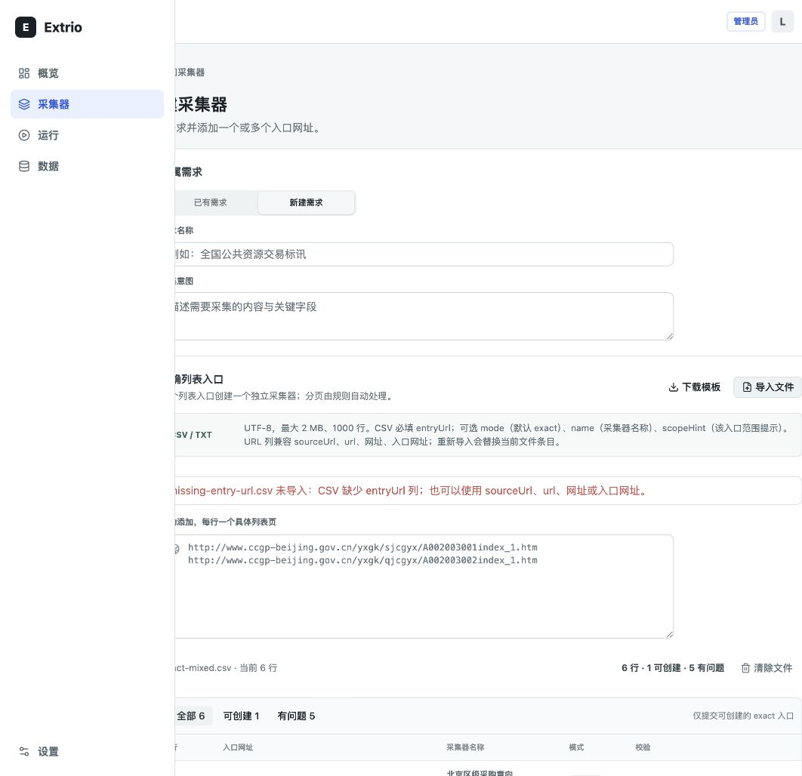
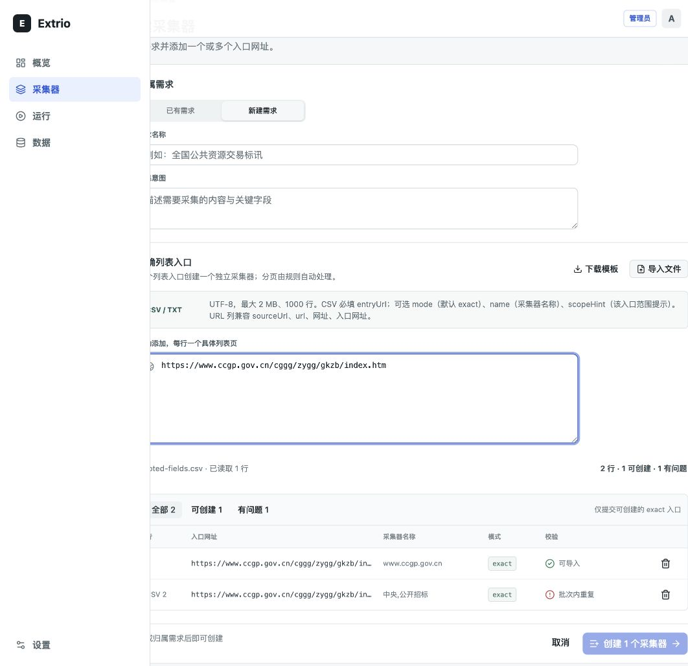
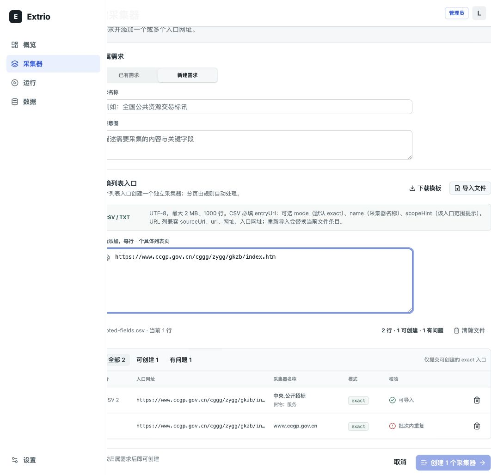
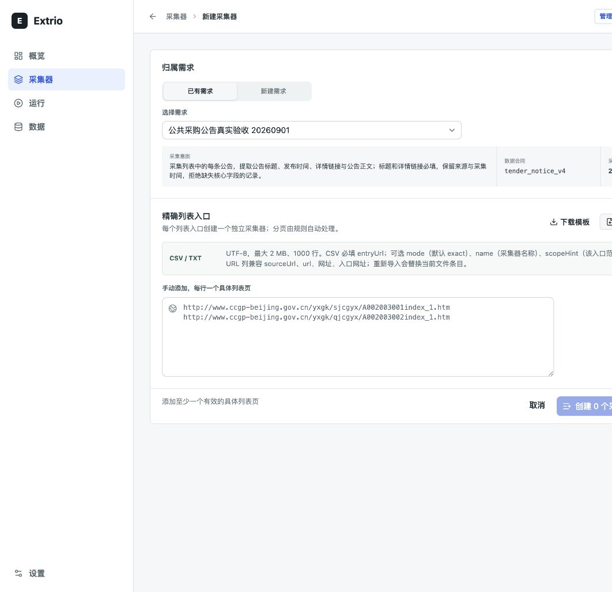

# CSV 导入浏览器复测

## 范围

- 页面：`/collectors/new`
- 目标用户：批量接入招投标列表页的数据运营人员
- 用户目标：用一份 CSV 建立多个精确入口采集器，在创建前发现并处理错误
- 输入样本：正常标讯 CSV、重复导入、缺少表头、额外列、引号与字段内逗号、根目录、重复 URL、非法 URL、非 `exact` mode、空 URL
- 辅助技术检查：浏览器可访问性树、表格语义、告警语义、按钮状态

## 测试步骤

| 步骤 | 操作 | 结果 | 健康度 |
| --- | --- | --- | --- |
| 1 | 导入 `test-data/tender-sites.csv` 与仅含 `entryUrl` 的 `minimal.csv` | 4 列模板与最小单列合同均解析成功；空 `mode` 使用 `exact`；文件名、有效数和范围提示可见 | 健康 |
| 2 | 导入 `exact-mixed.csv` 并切换筛选、移除问题行 | 正确识别 1 个可创建项与 5 个问题项；根目录、重复、非法 URL、非 `exact` mode 和空 URL 均有逐行原因 | 健康 |
| 3 | 在已有预览上导入 `missing-entry-url.csv` | 文件名与错误原因通过 `alert` 呈现，最近一次成功解析的 6 行预览保持不变 | 健康 |
| 4 | 重复选择另一份 CSV | 新文件替换原文件条目，不再隐式累加；手动输入仍保留 | 健康 |
| 5 | 手动输入与 CSV 使用同一 URL | CSV 行保持可创建并保留 `name`、`scopeHint`，手动行标为重复 | 健康 |
| 6 | 点击“清除文件” | 仅移除文件条目；同 URL 的手动入口恢复为可创建 | 健康 |
| 7 | 下载模板 | 下载 UTF-8 BOM、CRLF 的 `extrio-collector-import.csv`，包含 `entryUrl,mode,name,scopeHint` | 健康 |
| 8 | 补全需求名称和采集意图 | “创建 1 个采集器”进入可用状态；未执行创建，避免写入测试数据 | 健康 |

## 已修复问题

1. **重复导入会无提示累加。** 文件条目改为单文件替换语义，并在格式说明中明确“重新导入会替换当前文件条目”。
2. **手动入口会抢占同 URL 的 CSV 行。** 校验顺序改为文件优先，避免丢失 CSV 中的采集器名称和范围提示。
3. **文件级失败反馈过弱。** 错误增加文件名、明确原因和 `role="alert"`，且失败不会清空已有预览。
4. **缺少整体撤销入口。** 增加“清除文件”，只清除文件来源，不影响手动输入。
5. **`scopeHint` 仅依赖悬停查看。** 采集器名称下方直接显示范围提示。
6. **预览缺少完整表格语义。** 增加 table、row、columnheader、cell 与“操作”表头，删除按钮保持独立可访问名称。
7. **空入口单元格没有明确文本。** 预览使用“未填写”，避免用户误判为空白渲染故障。
8. **仅含必需 `entryUrl` 列的 CSV 被误判为分隔符错误。** 忽略 Papa Parse 对合法单列文件产生的 `UndetectableDelimiter` 提示，并保留结构性引号和额外列错误。

## 证据

错误文件保留最近一次成功预览：

修复前，手动行抢占 CSV 元数据：

修复后，CSV 元数据优先且范围提示可见：

浏览器批注复核后，新建页正文移除重复标题和返回链接，顶部栏统一承载返回按钮及“采集器 / 新建采集器”层级导航：

## 剩余建议

- 当前只支持 `exact`，不在界面暴露可选模式控件；CSV 保留 `mode` 列是为后续兼容，缺省值为 `exact`。
- 后续支持 `discover` 时，应作为独立的“发现入口”流程，先展示发现到的候选列表，再由用户勾选转成精确采集器，不能与 `exact` 混在一次直接创建中。
- 大批量创建的结果页仍应补充按失败原因筛选和导出失败行能力；这属于创建后的运营效率优化，不阻断当前导入流程。

## 自动化验证

- 前端测试：22 个测试文件、81 个测试全部通过。
- 静态检查：`pnpm lint` 通过。
- 生产构建：`pnpm build` 通过。
- 文档一致性：docset manifest 检查与 `git diff --check` 通过。

## 证据限制

本轮严格使用用户已打开的内置浏览器，实际截图视口为 `1062x1028`，低于产品支持的最小桌面宽度 `1280px`。因此这些截图只证明交互状态、错误恢复和语义结构，不作为 `1280x800` 或 `1440x900` 布局验收证据；本轮也未执行真实屏幕阅读器播报和自动对比度计算。
