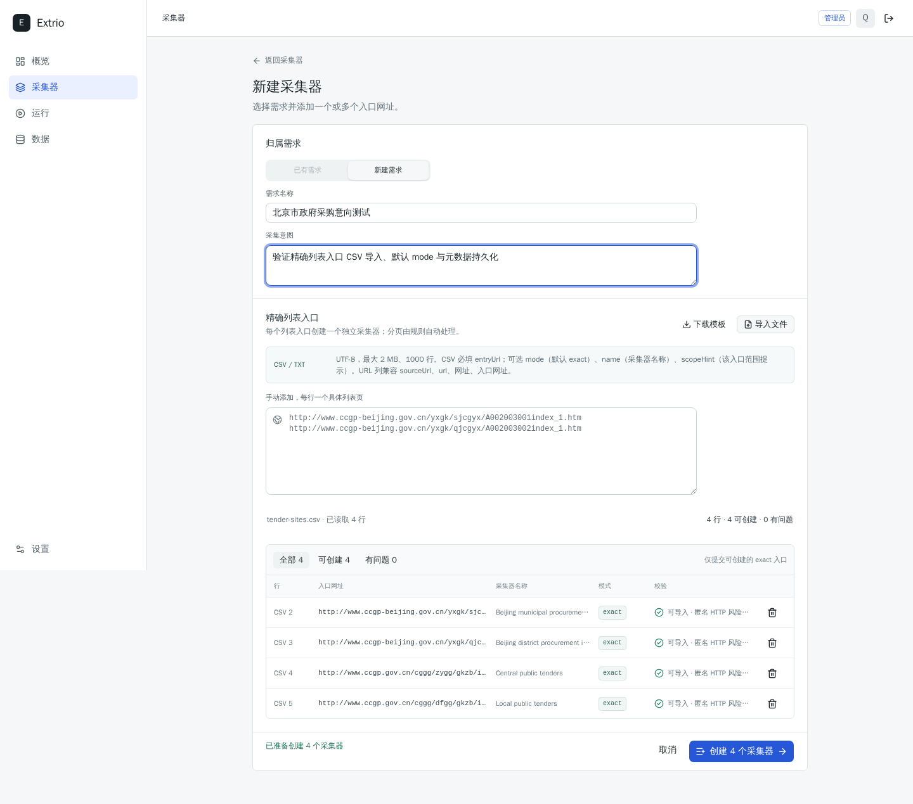
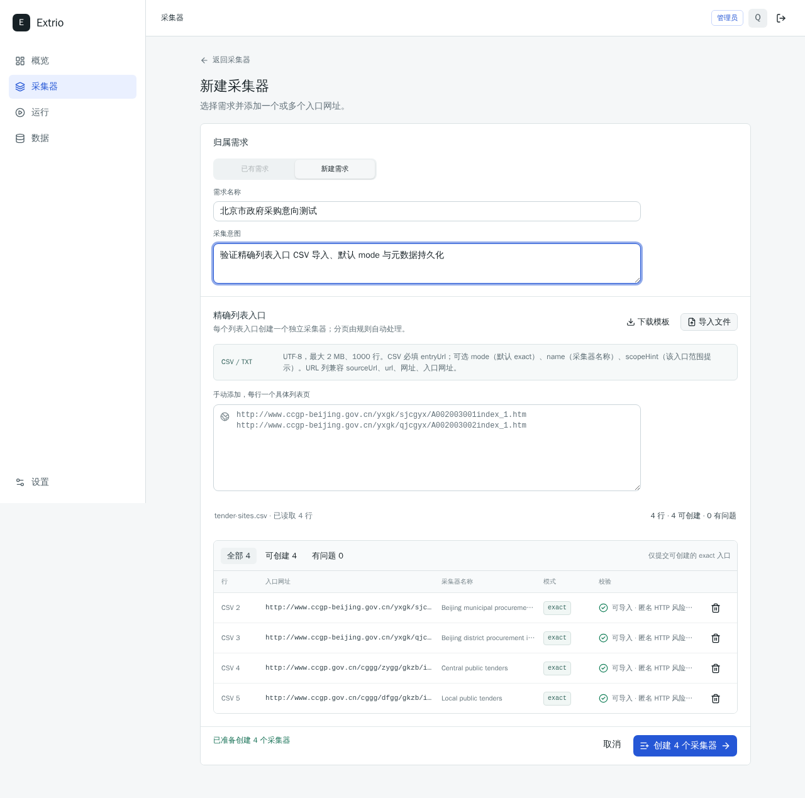
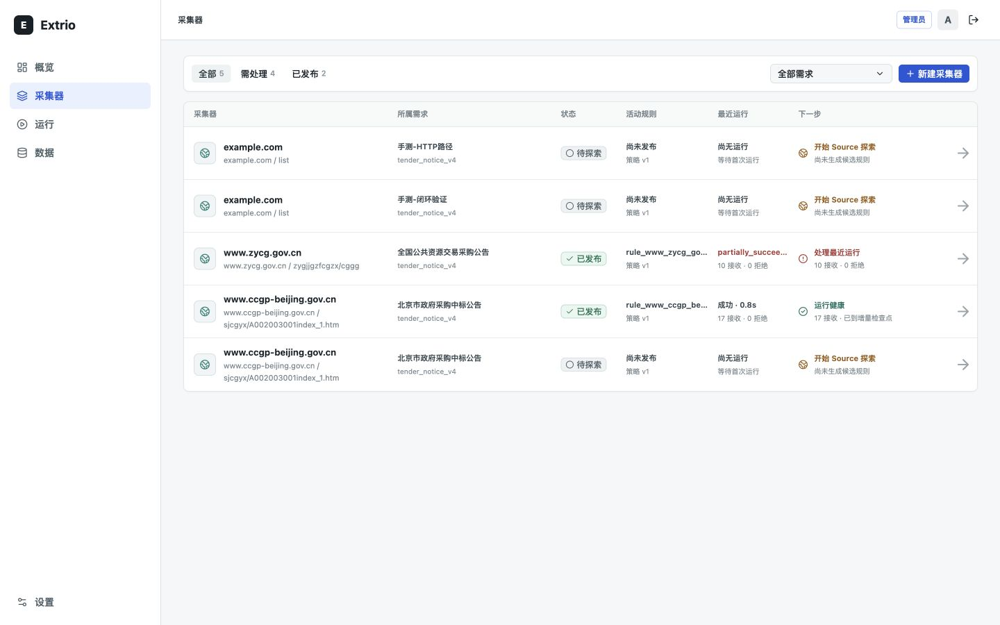
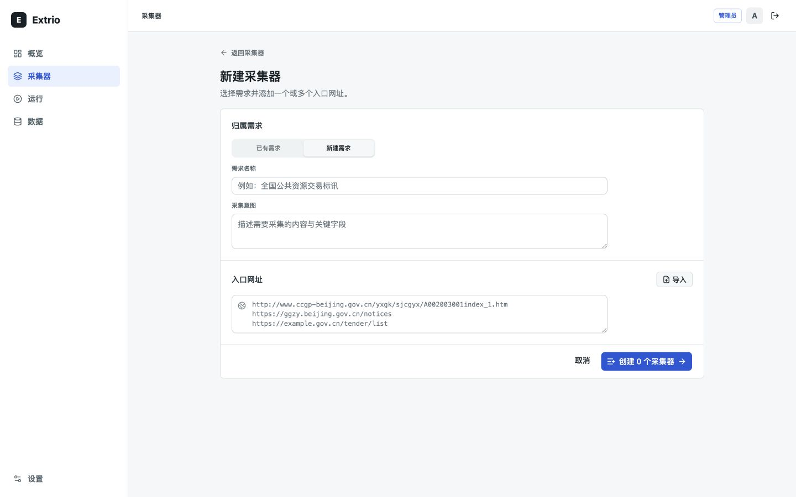
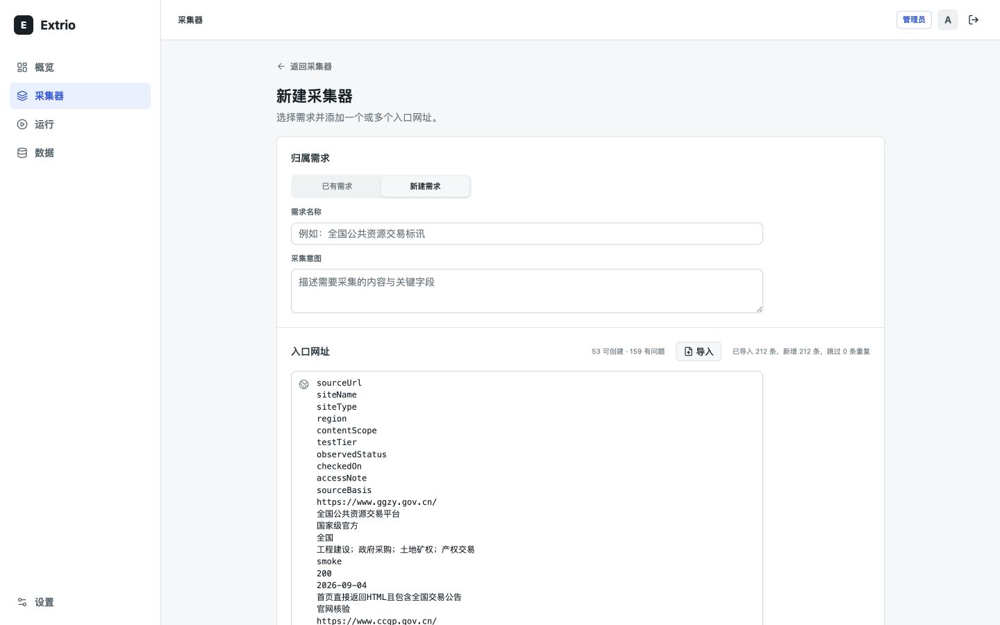
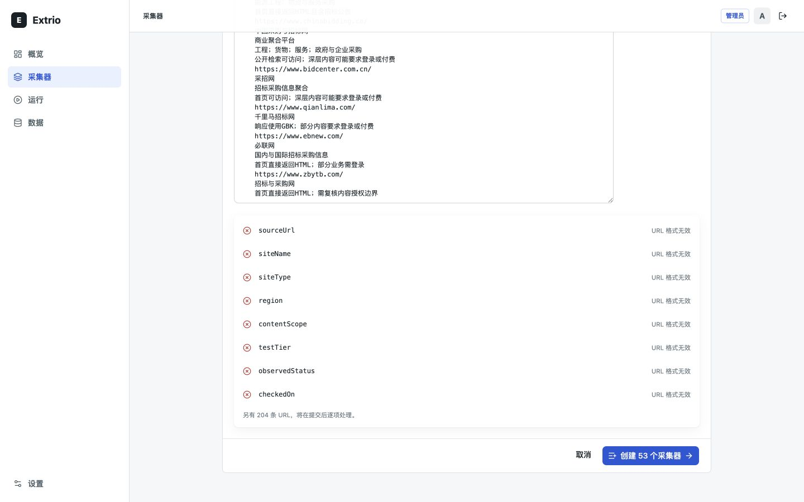
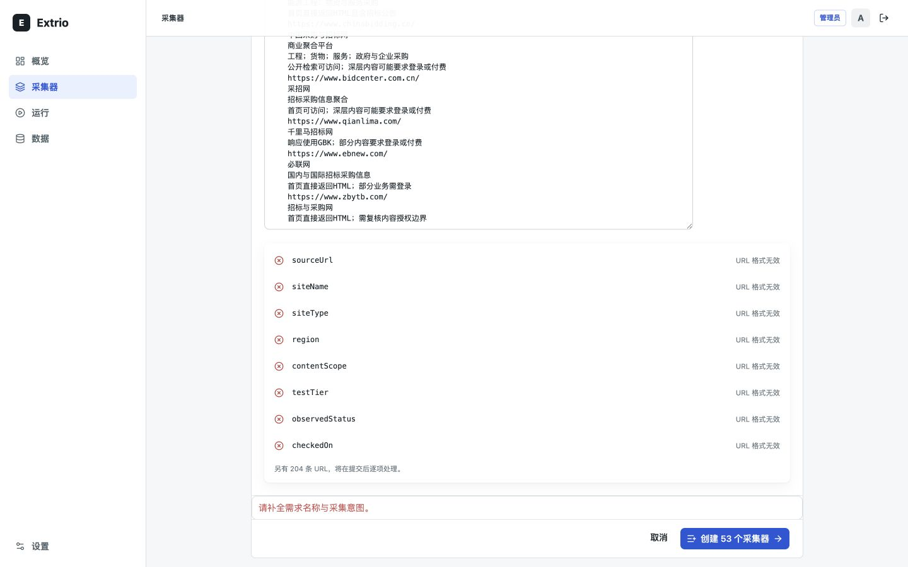
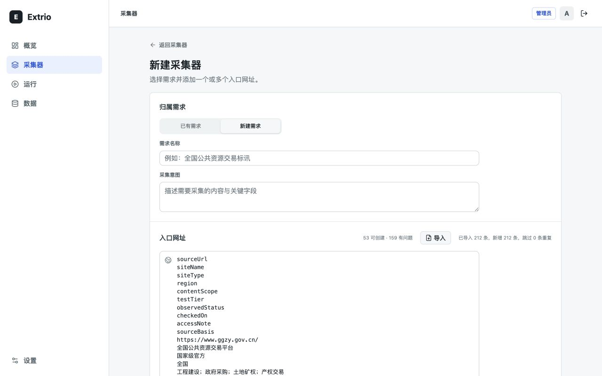

# 标讯网站 CSV 导入审查

## 审查范围

- 任务：从采集器列表进入新建页，导入 `test-data/tender-sites.csv`，检查解析、预览、校验和桌面布局。
- 视口：`1440x900`、`1280x800`。
- 首次审查文件：53 行数据，10 列，网址位于 `sourceUrl` 列。
- 首次审查限制：CSV 在解析阶段出现结构性错误，因此未提交创建，避免向本地实例写入 53 个采集器和 159 条无效结果。

## 修复验证

- 当前导入合同为精确入口：一个列表页创建一个 Collector，`mode` 可省略并默认为 `exact`，其他模式按行拒绝。
- CSV 要求 `entryUrl` 列，兼容 `sourceUrl`、`url`、`网址`和`入口网址`；`name`、`scopeHint`和 `mode` 为可选列。TXT 只按行解析，不再按逗号或分号拆分。
- 根目录和非 `exact` 模式会在预览中给出可操作错误；后端使用同样的逐行校验，避免前端绕过。
- 原始 53 个根网址保留为 `test-data/site-seeds.csv` 的未来发现种子；当前可运行的 `test-data/tender-sites.csv` 改为 4 个精确列表入口。
- 真实浏览器提交结果为 4 项中 3 项创建、1 项因本地已存在同一 URL 被正确拒绝；省略 `mode` 的北京区级入口按 `exact` 创建，CSV 中的名称被保留。
- `1440x900` 与 `1280x800` 定尺浏览器验证均无水平溢出；预览使用定高表格、内部滚动、行号、状态筛选和移除操作。

## 首次审查结论（修复前）

1. 采集器列表：基本健康。新建入口清晰，但列表暴露截断的内部规则 ID，最近运行还出现未本地化的 `partially_succee...`。
2. 新建采集器空表单：需要优化。文件导入入口可发现，但没有说明支持的格式、字段、编码、行数或文件大小。
3. 导入 CSV：失败。53 个网址被拆成 212 个文本片段，形成 53 个可创建项和 159 个无效项。
4. 检查导入预览：失败。网址输入框随 212 行内容扩展到 3650px，整页高度达到 4759px。
5. 提交前校验：需要优化。错误显示在长页面底部，焦点仍停在提交按钮，用户无法快速定位顶部缺失字段。
6. 最低支持视口：勉强可用。`1280x800` 没有明显重叠，但计数、导入按钮和导入反馈挤在同一行，字号小且扫描困难。

## 截图

### 1. 采集器列表

### 2. 导入前

### 3. CSV 被错误拆分

### 4. 错误预览与长页面

### 5. 校验错误位置

### 6. 1280px 视口

## 原始优先级清单（修复前）

### P0：先修复正确性

1. 使用真正的 CSV 解析器，不要按逗号、分号和换行直接切分。自动识别 `sourceUrl`、`url`、`网址`、`入口网址` 列，并正确处理 BOM、CRLF、引号、字段内逗号和字段内分号。
2. `.txt` 与 `.csv` 使用不同解析规则：TXT 每行一个 URL；CSV 按表头和列读取。当前 `parseImportedSourceUrls()` 会把表头和其他单元格当成网址。
3. 为网址输入框设置稳定高度和内部滚动，不允许批量内容撑高整页。本次实测输入框高 3650px，超过四个桌面视口。
4. 增加回归测试：当前测试把“逗号/分号切分”当作正确行为，没有覆盖带表头、多列、引号和中文标点的真实 CSV。

### P1：修复任务流和反馈

5. 在导入按钮旁直接说明：`支持 CSV、TXT；CSV 需包含 sourceUrl/url/网址列；UTF-8；最多 1000 个网址`。同时显示文件大小限制；未定义限制前不应默认为无限制读取。
6. 导入后显示文件名和基于记录的摘要，例如“53 行，识别 53 个网址，0 个问题，0 个重复”，不要使用“已导入 212 条”这种文本片段口径。
7. 将导入结果放进定高、可滚动的表格，提供“全部 / 可创建 / 有问题”筛选、CSV 行号、错误原因和移除操作。不要把全部原始 CSV 内容倾倒进自动增高的文本框。
8. 统一提交口径。当前按钮写“创建 53 个采集器”，请求却会发送 212 项并在结果页产生 159 条拒绝；应只提交有效项，或明确要求先解决问题再创建。
9. 空表单时不要显示可点击的“创建 0 个采集器”。满足必填项且至少有一个有效网址前禁用主操作，并解释未就绪原因。
10. 校验失败时在字段附近显示错误、设置 `aria-invalid`，并把焦点移动到第一个错误字段；不要只在页面底部显示总错误。
11. 把导入计数和反馈移到标题下方的独立摘要行。`1280px` 下当前一行同时承载标题、计数、按钮和反馈，信息过密。

### P2：可访问性与文案

12. 为 URL 文本框提供真实标签和 `aria-describedby`。当前辅助技术只能读到内部 ID `source-urls`。
13. 文件按钮和隐藏的文件输入在可访问性树中都叫“从文件导入网址”，形成重复控件；应只暴露一个可操作入口。
14. 状态摘要和文件反馈当前使用 10px 字号，最低支持视口下可读性不足，建议至少使用 12px 正文字号。
15. 统一用户可见术语，避免同屏混用“Source”“Collector”和中文；列表状态不得直接显示 `partially_succeeded` 等内部枚举。
16. 列表优先展示业务可理解的规则版本或状态，不要把截断的内部规则 ID 当作主信息。

## 首次验收建议

- 导入本次 CSV 后必须得到：53 个网址、0 个非网址单元格、0 个表头错误。
- 导入包含引号、逗号、分号、BOM 和 CRLF 的 CSV 后仍能稳定读取目标列。
- 导入 1000 个网址时输入和预览区域保持定高，页面主操作始终可达。
- CSV 缺少网址列、文件为空、格式不支持、超过行数或文件大小时，给出可操作的错误说明。
- 键盘用户只经过一个文件导入控件；提交失败后焦点落在第一个错误字段。
