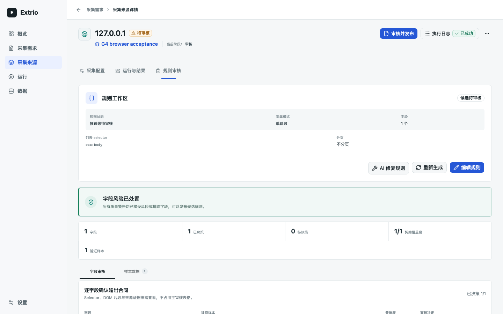
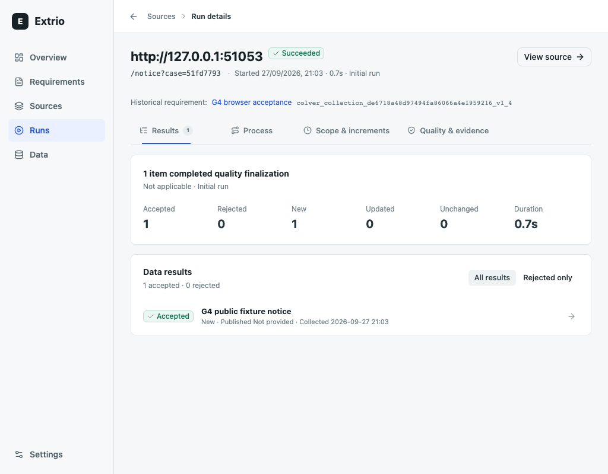

# STABLE1 集成验证

日期：2026-09-27。状态：`Needs_Review`，未发布的 `v1.0.0` 候选。
基线为已发布 RC `c2fc06f420c31aaf5bbbea53332ef4af2b48804e`，分支为
`codex/v1-stable-closeout-20260927`。本报告不是合并、发布或生产部署授权。
远程身份与 PR 检查结果以候选 PR 的 head SHA、Checks 和集成评论为准。

## 输入与环境

- 本轮生产代码仅修改版本号；没有更改运行逻辑、依赖版本或扫描策略。
- [candidate-inputs.sha256](candidate-inputs.sha256) 固定 365 个应用、测试、契约、构建及验证脚本输入；文档哈希另由 docset manifest 管理。
- macOS 26.5.2 arm64，Python 3.12.13，pnpm 11.24.0；Docker 使用 OrbStack，候选本地镜像为 linux/arm64。
- 自有 PostgreSQL 16 容器 `extrio-e2e-stable-pg-20260927` 监听回环端口 55497；测试各自创建随机数据库，主机 `pg_dump` 为 16.15。不连接或修改用户现有 PostgreSQL 18。
- 原始日志、数据库、镜像 tar、打包输出位于忽略目录 `backend/data/v1-stable-20260927/`；浏览器实例目录为 `backend/data/g4-qa-stable-{sqlite,pg}-20260927/`。不提交会话、密钥、原始模型配置或用户数据。
- QA API/Worker、源/模型 fixture 和 Web preview 均已停止；四套 Compose 环境已清理。独立 PG16 在确认仅余默认 `postgres` 数据库后删除；用户容器和项目共用 Trivy 缓存保留。候选包及镜像身份见 [artifacts.json](artifacts.json)。

## 回归与构建

仓库根目录执行；`EXTRIO_TEST_DATABASE_URL` 只指向上述隔离实例。

| 验证 | 命令 / 结果 |
| --- | --- |
| 后端 SQLite + PG16 全量 | `uv run --project backend --locked pytest -c backend/pyproject.toml backend/tests -q`，801 passed，0 skipped，545.74 秒 |
| 前端 | `pnpm --dir web test`：42 文件，264 passed；`pnpm --dir web lint`、`pnpm --dir web build` 均通过 |
| Ruff | `uv run --project backend --locked ruff check backend/src backend/tests scripts/update-docset-manifest.py`，通过 |
| OpenAPI 类型 | `pnpm --dir web api:generate` 后 `git diff --exit-code -- web/src/api/generated/schema.d.ts`，通过 |
| 文档合同与生成器 | 4 项文档回归通过；`uv run --project backend --locked python scripts/update-docset-manifest.py --check` 通过 |
| 历史升级 / 打包 / Compose 参数 | 26 passed，0 skipped，详见 [专项结果](release-validation.md)；包含实际 RC、Alpha 和 9 月基线的双库升级恢复 |
| NLTK 路径边界 | 15 项边界测试及 49 项关联回归通过，详见 [安全结论](security.md)；不是依赖修复 |
| sdist / wheel | `uv build --project backend --out-dir backend/data/v1-stable-20260927/packages`，两种格式成功，版本均为 1.0.0 |
| 本地镜像 | 后端和 Web 均构建成功；容器内 `extrio.__version__` 为 1.0.0；不推送镜像 |
| 镜像安全 | Trivy 0.69.3 对两份本地镜像扫描 `HIGH,CRITICAL --ignore-unfixed`，均为 0；不等于所有漏洞为零 |
| 源码 secret 扫描 | Trivy `fs --scanners secret --exit-code 1` 对非忽略文件快照扫描，0 secrets；PR 对远程提交独立扫描 |

Web 首次 Docker 构建因 Docker Hub token 连接超时退出；仅为该次命令使用机器已有
HTTP 代理后重试成功，没有修改宿主代理配置。扩大 Ruff 到所有历史 `scripts/` 的诊断
发现 5 项既存问题（`benchmark-data.py` 4 项、`g3-client-smoke.py` 1 项）；这些文件未修改，
未将扩展诊断记作通过。CI 正式范围及本轮改动脚本的 Ruff 检查通过。

归档升级测试使用实际历史代码与当前依赖环境，而非完整历史容器环境；RC 到本候选的
锁文件仅有本项目版本变化。该证据与以下实际发布镜像安装证据分别记录。

## 真实镜像安装

正式 RC 镜像来源为 [GitHub prerelease](https://github.com/iiwish/extrio/releases/tag/v1.0.0-rc.1)
的 `release-verification.json`，其 SHA-256 为
`8acacec7d9999564fa17f2ea1f0339d124bf925b199d5e795f8ae4f5ae81d5d3`。
签名及 provenance 核验属于该 RC 的发布证据，不能转作本候选的签名。

| 产物 | 已发布不可变引用 |
| --- | --- |
| Backend | `ghcr.io/iiwish/extrio-backend@sha256:0f841772c0dc5c45f7575203fb0fc599162fd16a40d64e5686869ce083bcb6af` |
| Web | `ghcr.io/iiwish/extrio-web@sha256:c693d8f48f491655820bfbbf6fc583ef8b9ca425a7814d7531521c024bca2981` |

两份摘要实际拉取到 OrbStack。设置上述 `EXTRIO_BACKEND_IMAGE` / `EXTRIO_WEB_IMAGE`，
分别用 `compose.yaml` 与 `compose.postgres.yaml` 执行
`bash scripts/verify-compose.sh --image-only`，均退出 0。
执行明确使用 `--no-build --pull always`，不是从源码重建已发布镜像。
SQLite 端口 18400/18480，PG16 端口 18401/18481；自有项目使用
`extrio-e2e-stable-rc-{sqlite,pg}-20260927`。独立卷和网络已清理。

本地稳定版候选使用 `extrio/backend:stable-20260927` / `extrio/web:stable-20260927`，
以脚本默认构建模式完成 SQLite / PG16 两套安装，均退出 0。项目为
`extrio-e2e-stable-candidate-{sqlite,pg}-20260927`，端口分别为 18402/18482、18403/18483；
临时容器、卷、网络已清理。检查包含健康/就绪、匿名请求 401、
首位管理员创建、有会话 API 访问、Web 入口、登出和原会话 401；PG 使用独立迁移服务。
本地 HTTP smoke 的 Secure cookie 开关仅用于隔离环境，不更改部署默认值。

## 桌面旅程

候选源码、真实鉴权 API/Worker、独立双库与 production Web build：两种数据库均完成
字段发布、来源绑定、AI 编译、人工审核、确定性运行、数据检查、CSV/JSONL 导出、
签名 Webhook、读取失败恢复、登出与重新登录。

每个数据库 17 个页面 × 中英文 × 4 桌面视口 = 136 组，共 272 组；
两套结果均 `runStatus=succeeded`、`signedDeliveries=1`、`pageErrors=[]`。
1440×900、1280×800、1132×1028、1024×800 均检查页面宽度；移动端不在范围内。
模型端使用合成 HTTPS 协议 fixture，不把这项测试记作真实模型或外部来源成功率。

命令为 `scripts/g4-qa-instance.py --output <owned-instance> --api-port 18364 --web-port 18365`，
PG 变体另传 `--postgresql`；生产前端通过 Vite preview 与显式 API proxy target 运行。
`scripts/g4-browser-qa.py --instance <owned-instance> --web http://127.0.0.1:18365` 完成旅程。
脱敏测量见 [SQLite](browser-sqlite.json) / [PostgreSQL](browser-postgresql.json)。
代表性截图已人工检查规则审核、字段版本与运行详情；没有改动界面或放宽断言。

## 有限负载

`scripts/benchmark.py --collectors 3 --pages 2`：6/6 Run 成功，42 页，24 accepted、0 rejected，
12 new / 12 unchanged；墙钟 23.95 秒，单次 p50 3.60 秒、p95 3.65 秒。
`scripts/benchmark-data.py --rows 100000` 及 `--postgres`：每库 100,000 observations、
20,000 entities，全游标遍历无重复、导出条数正确。

| 数据库 | Observation 首屏 median | Entity 首屏 median / max | 20k entity 遍历 | 100k 导出 |
| --- | --- | --- | --- | --- |
| SQLite | 2.12 ms | 856.21 / 1666.55 ms | 25.98 s | 0.78 s |
| PostgreSQL 16 | 30.66 ms | 1048.34 / 2414.21 ms | 24.13 s | 2.85 s |

原始有限测量见 [SQLite](scale-sqlite.json) / [PostgreSQL](scale-postgresql.json)。
测量期间机器有其他测试/构建负载，不用于严格版本性能对比、平台容量或延迟 SLO 宣称。
72 小时观测沿用既有豁免，不计为通过；本轮没有新增真实模型付费调用。

## 待用户决定

NLTK 无修复 HIGH 告警仍为 open。六个受影响 API 的正控制与有限应用路径负向证据
不构成全局不可达证明；稳定版需独立接受限定残余风险，或等待修复/另行批准依赖改造。
PR CI、产品/技术签收、合并后精确 main SHA 验证以及正式双架构发布门槛均独立。
没有合并、创建稳定 tag、运行 release、推送稳定镜像或部署生产。
