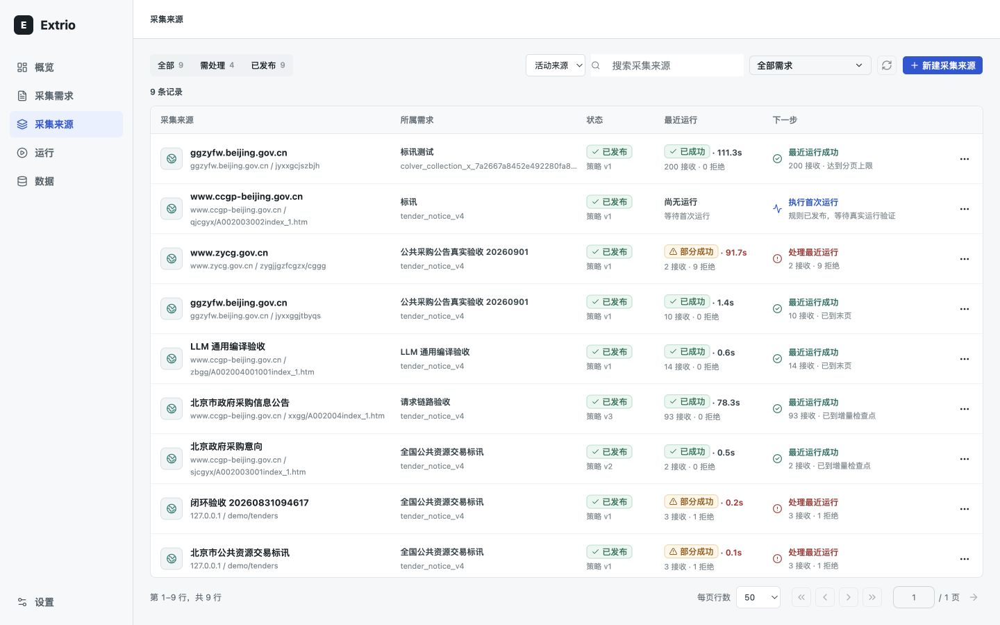
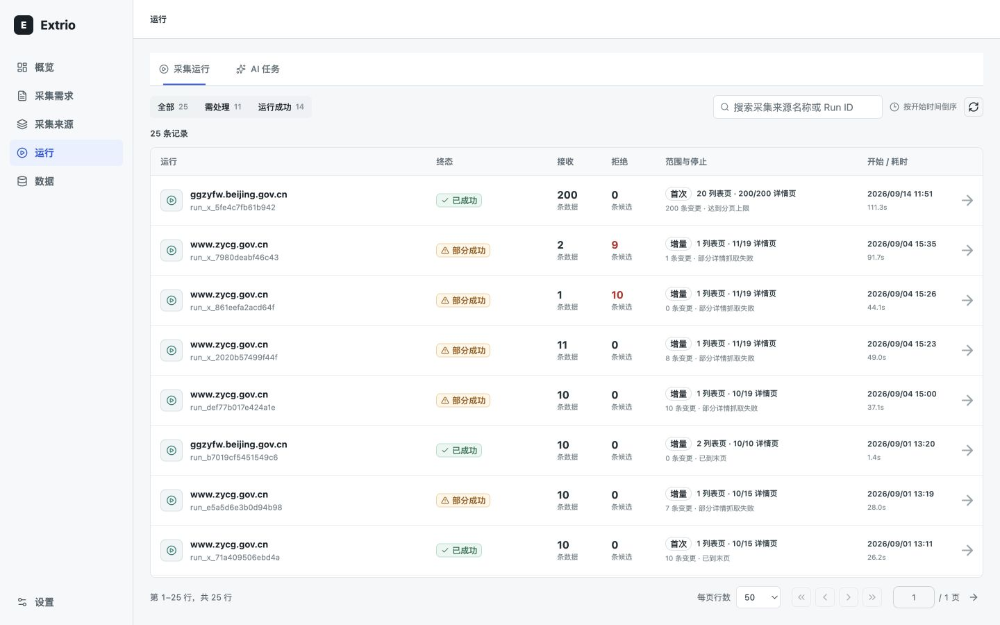

# Extrio public-alpha walkthrough

Extrio is a desktop, self-hosted collection console. This demonstration targets
1440x900 and uses local or explicitly authorized data. It does not demonstrate
multi-tenant isolation, production-scale throughput or a hosted service.

## Three-minute sequence

| Time | Surface | What to demonstrate |
| --- | --- | --- |
| 0:00-0:30 | Collection requirements | Open a requirement and inspect required fields and the output contract. |
| 0:30-1:00 | Collection sources | Show the entry URL and its linked requirement; explain the source boundary. |
| 1:00-1:40 | Source detail | Inspect candidate evidence and publication state. AI proposes rules; a human approves publication. |
| 1:40-2:15 | Runs | Open a completed run; inspect outcome, counts and failure evidence rather than only a success badge. |
| 2:15-3:00 | Data | Page through results and open an item to trace its source, run and rule version. |

Use pre-existing completed runs for a timed presentation. Do not present a fixture
as a live model response. Fresh AI exploration requires a configured model and can
take longer than the presentation. Do not expose API keys, private URLs or personal
data in screenshots or recordings.

## Screenshot tour

These are local desktop acceptance screenshots. This document is a walkthrough,
not a video recording or evidence of external adoption.

## Reproducible execution

Follow the root README for locked installation and startup. The disposable
`scripts/benchmark.py --collectors 1 --pages 1` path executes a fixed signed rule
through the worker without model charges, external scraping or writes to an
existing instance. AI onboarding is a separate validation boundary.

## Resume positioning

Describe the project as an open-source, self-hosted public alpha: a React and
TypeScript operations console, Python control plane, human-reviewed AI rule
generation, deterministic execution, and item-level evidence. Cite measured test
and fixture results with their scope. Do not claim production adoption, arbitrary
website compatibility, commercial availability or a completed 72-hour soak test.
